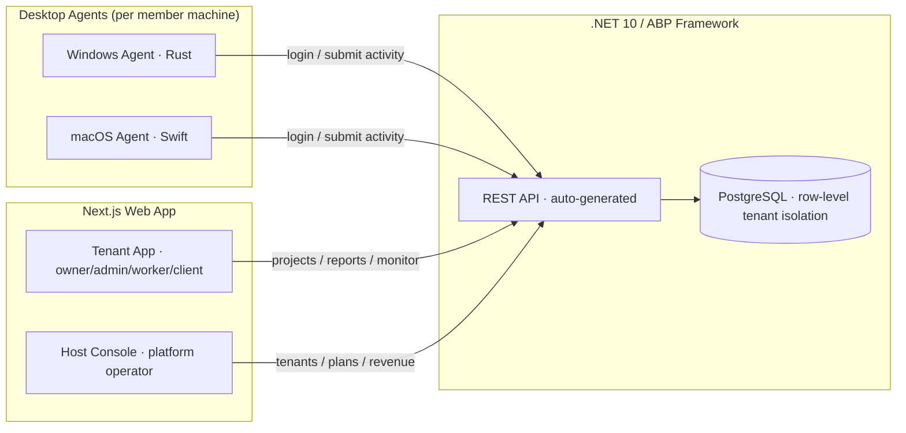
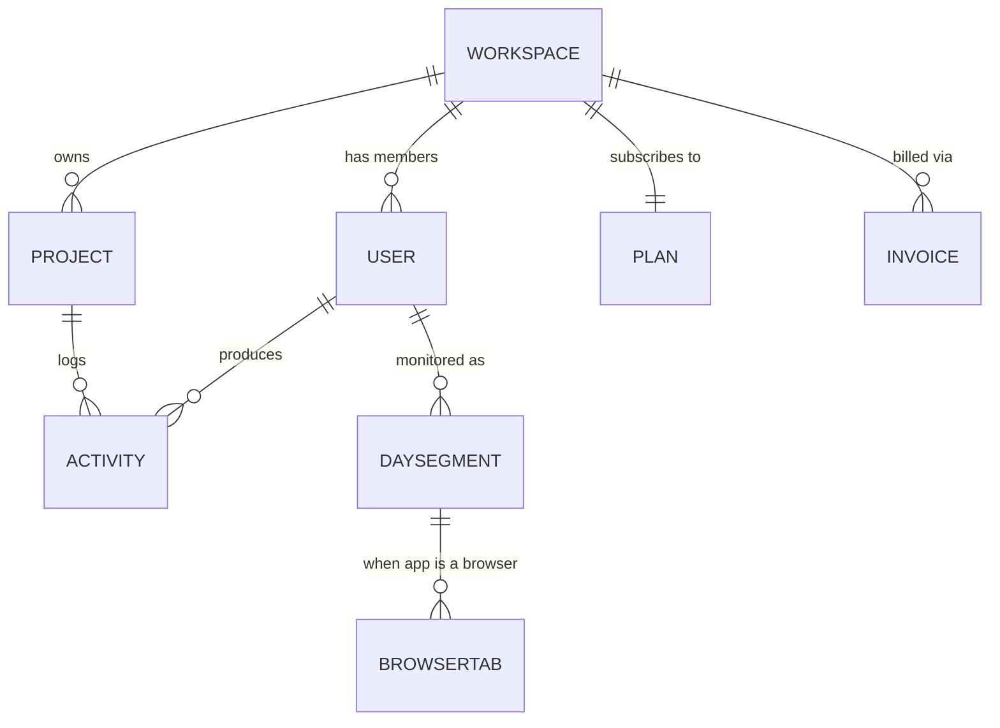
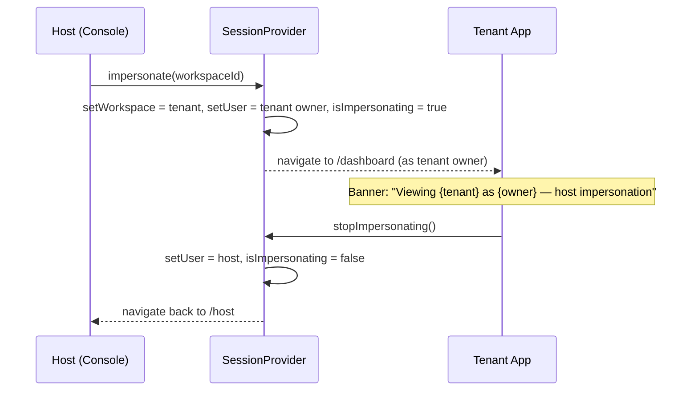

# Dosi-Tracker — Full Project Documentation

> A complete, open-source, **multi-tenant SaaS** platform for team activity &
> time tracking. Lightweight native desktop agents capture work activity;
> a modern web dashboard turns it into projects, monitoring, and reports; and a
> platform **Host Console** operates the whole SaaS across every tenant.

This document is the single source of truth for the **product idea, UI features,
roles, and demo behavior** (English). It is written so each section builds on
the previous one — read top-to-bottom, or jump via the table of contents.

**Related docs (do not duplicate long-form here):**

| Need | Go to |
|------|--------|
| Bengali engineering course (chs 1–23) | [`docs/bn/README.md`](./docs/bn/README.md) |
| What the code actually has | [`docs/AS_BUILT.md`](./docs/AS_BUILT.md) |
| Production gaps | [`docs/PRODUCTION_READINESS.md`](./docs/PRODUCTION_READINESS.md) |
| Run / recover | [`docs/RUNBOOK.md`](./docs/RUNBOOK.md) |
| Security posture | [`docs/SECURITY.md`](./docs/SECURITY.md) |

---

## Table of Contents

1. [Product Vision & Idea](#1-product-vision--idea)
2. [Personas & Roles](#2-personas--roles)
3. [SaaS & Multi-Tenancy Model](#3-saas--multi-tenancy-model)
4. [System Architecture](#4-system-architecture)
5. [Technology Stack](#5-technology-stack)
6. [Repository Layout](#6-repository-layout)
7. [Frontend Architecture](#7-frontend-architecture)
8. [Domain & Data Model](#8-domain--data-model)
9. [The Productivity Model](#9-the-productivity-model)
10. [Tenant App — Feature Deep-Dives](#10-tenant-app--feature-deep-dives)
11. [Host / Platform Admin Console](#11-host--platform-admin-console)
12. [Impersonation Flow](#12-impersonation-flow)
13. [Multi-Tenant Data Isolation (Frontend)](#13-multi-tenant-data-isolation-frontend)
14. [Design System & UX](#14-design-system--ux)
15. [Responsiveness](#15-responsiveness)
16. [Backend Plan (.NET 10 + ABP)](#16-backend-plan-net-10--abp)
17. [Desktop Clients Plan (Rust / Swift)](#17-desktop-clients-plan-rust--swift)
18. [Frontend File Reference](#18-frontend-file-reference)
19. [Demo Accounts & How to Explore](#19-demo-accounts--how-to-explore)
20. [Getting Started](#20-getting-started)
21. [Status: Mock vs Real](#21-status-mock-vs-real)
22. [Roadmap](#22-roadmap)
23. [Glossary](#23-glossary)

---

## 1. Product Vision & Idea

**The problem.** Distributed and in-office teams need an honest, low-friction way
to understand where working time goes — which projects, which apps, how focused —
without heavy, battery-draining spyware and without collecting sensitive content
like keystrokes.

**The idea.** Dosi-Tracker splits the product into three cooperating parts:

- **Tiny native agents** on each member's machine capture *signals* (periodic
  screenshots, active window, app usage, keyboard/mouse **counts** — never
  content) with near-zero CPU when idle.
- **A web dashboard** turns those signals into meaning: live activity, per-member
  daily monitoring, projects, timesheets, and a broad reporting suite.
- **A SaaS platform layer** so any company can sign up as an isolated **tenant**
  (workspace), pick a **plan**, invite members, and be billed — all operated
  centrally from a **Host Console**.

**Design principles** (referenced throughout this document):

| Principle | What it means in practice |
|-----------|---------------------------|
| Privacy-first | Only keyboard/mouse **counts**, never keystroke content. Screenshots can be blurred. |
| Efficiency-first | Native agents, event-driven input, interval capture → ~0% idle CPU, low RAM. |
| Multi-tenant by default | Every company is an isolated tenant; data never crosses tenants. |
| Role-appropriate views | Owner, Admin, Member, Client each see a purpose-built experience. |
| Deterministic demo | The web app ships with realistic, reproducible demo data so it can be explored with no backend. |

These principles map directly onto features: privacy → [Settings tracking toggles](#settings)
and [Activity model](#8-domain--data-model); efficiency → [Desktop clients](#17-desktop-clients-plan-rust--swift);
multi-tenancy → [SaaS model](#3-saas--multi-tenancy-model) and [Host Console](#11-host--platform-admin-console).

---

## 2. Personas & Roles

The platform has **five roles**. Four live *inside* a tenant; one operates the
platform itself. Roles are defined in `frontend/src/lib/types.ts` and their
labels/access in `frontend/src/lib/roles.ts`.

| Role | Scope | Persona | Primary jobs |
|------|-------|---------|--------------|
| **`host`** | Platform (all tenants) | SaaS operator | Manage tenants, plans, revenue, global users; impersonate tenants |
| **`owner`** | One tenant | Company founder / lead | Everything Admin can do **plus billing & plan** |
| **`admin`** | One tenant | Team manager | Members, projects, monitoring, reports (no billing) |
| **`worker`** (Member) | One tenant (self) | Individual contributor | Own activity, timesheet, assigned projects, own monitor |
| **`client`** | One tenant (read-only) | External stakeholder | Read-only progress of their project(s) |

**Owner vs Admin** — the practical difference is *ownership of the subscription*:
only the **Owner** can access `/billing` (plan, seats, invoices, payment).
Admins run day-to-day operations but cannot change the plan or see billing.

**Role → access matrix** (`navAccess` in `roles.ts`; enforced by
[`RoleGuard`](#7-frontend-architecture) and the sidebar):

| Route | host | owner | admin | worker | client |
|-------|:----:|:-----:|:-----:|:------:|:------:|
| `/host/*` | ✅ | | | | |
| `/dashboard` | | ✅ | ✅ | ✅ | ✅ |
| `/projects` | | ✅ | ✅ | ✅ | |
| `/team` | | ✅ | ✅ | | |
| `/monitor` | | ✅ | ✅ | ✅ (self) | |
| `/activities` | | ✅ | ✅ | ✅ | |
| `/screenshots` → `/activities?view=screens` | | ✅ | ✅ | ✅ | |
| `/timesheet` | | ✅ | ✅ | ✅ | |
| `/reports` | | ✅ | ✅ | | |
| `/insights` → `/dashboard` | | ✅ | ✅ | | |
| `/billing` | | ✅ | | | |
| `/settings` | | ✅ | ✅ | ✅ | ✅ |

Clients see a **progress portal** on `/dashboard` (hours & updates) — not capture review.
Workers get a **Privacy** tab in Settings explaining what the agent collects.

The **landing page** after login is role-aware (`landingFor` in `roles.ts`):
`host → /host`, everyone else → `/dashboard`.

---

## 3. SaaS & Multi-Tenancy Model

Dosi-Tracker is a **B2B SaaS**. The core noun is the **Workspace** (a *tenant*).

- A **Workspace** = one company's isolated world: its own members, projects,
  activities, screenshots, usage, and billing.
- Each workspace is on a **Plan** (Free / Starter / Business / Enterprise) with a
  **subscription status** (active / trialing / past_due).
- Members access their workspace through role-scoped views. A workspace **Owner**
  manages the subscription.
- The **Host** operates *all* workspaces from the [Host Console](#11-host--platform-admin-console).

**Plans** (`frontend/src/lib/saas-data.ts`):

| Plan | Price (per user/mo) | Seats | Projects | Storage | Retention | Highlight |
|------|--------------------:|------:|---------:|--------:|----------:|:---------:|
| Free | $0 | 3 | 2 | 1 GB | 7 days | |
| Starter | $6 | 10 | 10 | 20 GB | 30 days | |
| Business | $12 | 50 | ∞ | 500 GB | 180 days | ⭐ Popular |
| Enterprise | Custom | ∞ | ∞ | ∞ | 365 days | |

**Subscription lifecycle**: a new paid workspace starts `trialing` (14-day
cycle), converts to `active`, and can fall to `past_due` (rendered as
**Suspended** in the Host Console). Free plans are `active` with no cycle.

**Usage & billing math** (see also [Billing](#billing) and
[Platform Billing](#11-host--platform-admin-console)):

- `monthlyCost(ws) = plan.pricePerUser × seatsUsed` (Enterprise = custom/`null`).
- Usage meters compare `used` vs `plan.limit` per resource (seats, projects,
  storage, retention) via `usagePct()` / `fmtLimit()`.
- Invoices are derived per workspace: trialing → one `upcoming` invoice;
  active → five recent `paid` invoices.

This model is intentionally mirrored on the backend by ABP's SaaS/Tenant
modules — see [Backend Plan](#16-backend-plan-net-10--abp).

---

## 4. System Architecture



**Flow summary:**

1. Native agents authenticate and push activity snapshots (offline-first queue).
2. The backend stores everything per-tenant and exposes an auto-generated REST API.
3. The tenant web app reads/writes a single tenant's data based on the logged-in
   member's role.
4. The Host Console reads/writes across all tenants for platform operations.

The remainder of this document focuses primarily on the **web app** (fully
implemented as a demo) and the **plans** for the backend and agents (scaffolded).

---

## 5. Technology Stack

| Layer | Technology | Why |
|-------|-----------|-----|
| **Web frontend** | Next.js 16 (App Router), React 19, TypeScript | Modern routing, RSC-ready, type safety |
| **Styling** | Tailwind CSS v4, CSS variables | Themeable design tokens, light/dark |
| **Charts** | Recharts | Declarative, responsive charts |
| **Icons** | lucide-react | Consistent, tree-shakeable icon set |
| **Utils** | clsx + tailwind-merge, date-fns | Class composition, date formatting |
| **Backend** | .NET 10, ABP Framework, EF Core, PostgreSQL | DDD/Clean Architecture, auto REST API, built-in multi-tenancy & SaaS |
| **Windows agent** | Rust | Minimal RAM/CPU background service |
| **macOS agent** | Swift | Native ScreenCaptureKit / AVFoundation / Accessibility |

**Frontend runtime choices that matter:**

- A **fixed reference clock** `NOW` (`lib/mock-data.ts`) makes all demo data
  deterministic so SSR and client renders match (no hydration drift).
- Time is modeled in **minutes-from-midnight** where timelines are involved
  (`lib/monitor-data.ts`) to avoid timezone bugs.
- Synthetic **screenshot mocks** (`components/screen-mock.tsx`) render
  gradient/window placeholders — no binary image assets are shipped.

---

## 6. Repository Layout

```
Dosi-Tracker/
├── backend/            # .NET 10 + ABP (DDD / Clean Architecture), REST API, PostgreSQL
├── frontend/           # Next.js web app: Tenant App + Host Console  ← main focus of this doc
├── clients/
│   ├── windows/        # Rust background agent
│   └── macos/          # Swift background agent
├── README.md           # Short monorepo overview
└── DOCUMENTATION.md    # ← this file
```

See [Frontend File Reference](#18-frontend-file-reference) for a complete map of
`frontend/src`.

---

## 7. Frontend Architecture

The web app is a Next.js **App Router** project. It is split into three route
groups + a login page, all wrapped by a single root layout that provides theming
and session:

```
frontend/src/app/
├── layout.tsx              # Root: fonts, ThemeProvider, SessionProvider
├── page.tsx                # Entry redirect
├── login/page.tsx          # Sign in, create workspace, demo accounts, Host login
├── (dashboard)/            # Tenant App — role-scoped
│   ├── layout.tsx          # Sidebar + Topbar + RoleGuard + impersonation banner
│   └── dashboard, projects, team, monitor, activities, screenshots,
│       timesheet, reports, insights, billing, settings
└── (host)/                 # Host Console — platform operator only
    ├── layout.tsx          # HostSidebar + HostTopbar + host guard
    └── host, host/tenants, host/plans, host/users, host/billing
```

**Cross-cutting building blocks:**

- **`SessionProvider`** (`components/session-provider.tsx`) — the heart of the
  app. Holds the current **user**, current **workspace**, the full workspace
  list (seed + created − deleted, with patches), and exposes: `setUserById`,
  `setWorkspaceById`, `createWorkspace`, `updateWorkspace`, `deleteWorkspace`,
  and the host operations `isHost`, `isImpersonating`, `impersonate`,
  `stopImpersonating`, `loginAsHost`. It persists to `localStorage` and points
  the [tenant data layer](#13-multi-tenant-data-isolation-frontend) at the active
  workspace.
- **`RoleGuard`** (`components/role-guard.tsx`) — blocks routes the current
  role can't access (uses `canAccess` from `roles.ts`).
- **`ThemeProvider`** (`components/theme-provider.tsx`) + `ThemeToggle` —
  light/dark via a `.dark` class and CSS variables.
- **Command Palette** (`components/command-palette.tsx`) — ⌘K/Ctrl+K fuzzy nav &
  quick actions, filtered by role & recomputed on workspace change.
- **Toasts** (`components/toast.tsx`) — event-driven notifications
  (`toast({...})`) rendered by a viewport in each layout.
- **UI kit** (`components/ui/*`) — `Button`, `Card`, `Badge`, `Avatar`, `Ring`,
  `Progress`, `Switch`, `Input`/`Select`, `Modal`, `Drawer`, `DataTable`,
  `ThemeToggle`.

**Data layers** (`frontend/src/lib`):

| File | Responsibility |
|------|----------------|
| `types.ts` | Core domain types (`Role`, `User`, `Project`, `Activity`, …) |
| `mock-data.ts` | The **primary tenant (w1)** deterministic seed data + `NOW` |
| `tenant-data.ts` | Per-tenant dataset builder + **live active-tenant bindings** |
| `saas-data.ts` | Plans, workspaces (tenants), usage, invoices, helpers |
| `host-data.ts` | Platform roll-ups across all tenants (overview, MRR, users, invoices) |
| `reports-data.ts` | Report types + pure helpers (ranges, categories, catalog) |
| `monitor-data.ts` | Per-member daily timeline generation + browser tabs |
| `activity-filters.ts` | Filter state + application for the Activities page |
| `scope.ts` | Role-based scoping of projects/activities to the current user |
| `roles.ts` | Role labels, descriptions, access rules, landing routes |
| `export.ts` / `utils.ts` | CSV export, formatting helpers |

---

## 8. Domain & Data Model

All types live in `frontend/src/lib/types.ts` (tenant domain) and
`saas-data.ts` (SaaS domain). Key entities and how they relate:



**Tenant domain:**

- **`User`** — `id, name, email, role, designation, status (active/idle/offline),
  timezone, trackedToday (min), productivity (0–100), joinedAt`.
- **`Project`** — `id, title, color, archived, intervalMinutes, permissions
  (TrackingPermissions), memberIds[], logged{Week,Month,Total}`.
- **`Activity`** — a tracked block: `userId, projectId, started/endedAt,
  description, productivity, mouseClicks, keyboardHits, activeWindows[],
  runningPrograms[], screen (ScreenMock), hasWebcam, online`.
- **`DaySegment`** (monitor) — one slice of a member's day: `type
  (work/meeting/break/idle), start/endMin, app, windowTitle, projectId,
  productivity, mouse/keyboard counts, screen`, and — **for browser apps** — an
  array of **`BrowserTab`** `{ title, domain, url, minutes, category, color }`.

**SaaS domain:**

- **`Plan`** — pricing tier & limits (see [SaaS model](#3-saas--multi-tenancy-model)).
- **`Workspace`** — a tenant: `id, name, slug, planId, status, color, createdAt,
  cycleDays, seatsUsed, projectsUsed, storageUsedGb, isPrimary?`.
- **`UsageMetric`**, **`Invoice`** — derived per workspace.

**Host domain** (`host-data.ts`) — computed, not stored:
`TenantMetrics`, `PlatformOverview`, `PlanBreakdown`, `GrowthPoint`,
`GlobalUser`, `PlatformInvoice`.

---

## 9. The Productivity Model

Every activity/segment carries a **productivity score (0–100)**. Apps are
categorized as **productive / neutral / unproductive** (`reports-data.ts`
`AppCategory` + `categoryColor`; browser sites in `monitor-data.ts`).

- **Productive** — dev tools, design, docs authoring (VS Code, Terminal, Figma,
  GitHub, docs).
- **Neutral** — communication & reference (Slack, email, calendar, Notion).
- **Unproductive** — distractions (YouTube, X, Reddit, Spotify).

**How a member's day splits** (`tenant-data.ts` `deriveSplit`), given
`total = trackedToday` and `p = productivity`:

```
productive   = total × p / 100
remaining    = total − productive
unproductive = remaining × 0.35
neutral      = remaining − unproductive
idle         = total × 0.08
```

**Team focus %** (used in Insights and Apps reports) =
`productive minutes ÷ (productive + neutral + unproductive)` across the app
catalog. This same categorization drives the [Apps & Websites report](#reports-suite),
the [Member Monitor browser overview](#member-monitor), and platform-level
[avg productivity](#11-host--platform-admin-console) (member-weighted).

---

## 10. Tenant App — Feature Deep-Dives

All pages below live under `(dashboard)` and are role-scoped by `RoleGuard` and
data-scoped by `scope.ts`.

### Dashboard
Role-adaptive entry (`dashboard/page.tsx`):
- **Owner/Admin** → `AdminDashboard`: org KPIs (tracked, active members, avg
  productivity, screenshots), weekly activity trend, time-by-project donut, top
  apps, hourly focus, team leaderboard, live activity feed.
- **Worker** → `WorkerDashboard`: personal stats, own projects & recent activity.
- **Client** → `ClientDashboard`: read-only progress of their project(s).

### Projects
- **List** (`projects/page.tsx`): searchable/filterable project cards with color,
  members, logged time; **Create Project** modal with per-project tracking
  permissions and capture interval.
- **Detail** (`projects/[id]/page.tsx`): KPIs, members, activity, settings.

### Team
`team/page.tsx`: member directory with role filters, status, productivity;
**Invite member** modal; a **Seats** usage meter tied to the plan (Owners see an
"Upgrade" path when full). Invite is disabled at the seat limit — this is the UI
side of the [SaaS seat model](#3-saas--multi-tenancy-model).

### Member Monitor
`monitor/page.tsx` + `monitor-data.ts` — the deepest per-member view. Pick a
member and a day, then switch between two views:

- **Timeline view** — KPIs (tracked, productivity, longest focus, idle+breaks,
  first/last seen), an **activity band**, a detailed chronological list of
  segments (app, project, productivity ring, mouse/keyboard), hourly focus chart,
  apps-used breakdown, and a **screenshot timeline**.
- **Schedule view** — a calendar-style day grid (hour axis + blocks). Blocks are
  compact; **click a block → detail modal** with the segment's screenshot,
  metrics, and — for browsers — the full **open-tabs list**.
- **Browser activity** — for any browser segment, tabs are generated with
  domain, title, time, and category. A per-day **Browser activity** card rolls up
  browsing time, distinct sites, tabs opened, a category split bar, and a
  per-site breakdown; timeline rows show an inline "Open tabs" list. This answers
  "which sites/tabs and how long" at a glance, consistent with the
  [productivity model](#9-the-productivity-model).

### Activities
`activities/page.tsx` + `activity-filter-bar.tsx`: a gallery of tracked sessions
with a **comprehensive filter bar** — free-text search, member, project, sort,
date-range presets (+ custom), time-of-day window, application, productivity
range slider, and toggles (live only / with webcam). Active filters show as
removable chips. Clicking a card opens a **detail drawer** (screenshot, metrics,
productivity, webcam, active windows, running programs).

### Screenshots
`screenshots/page.tsx`: a responsive gallery of captures with the same filtering
philosophy and a lightbox.

### Timesheet
`timesheet/page.tsx`: a weekly **heatmap** (members × days) with per-day and
per-member totals; week navigation; summary cards (total, busiest day, average).

### Reports Suite
`reports/page.tsx` (catalog) + `reports/[slug]/page.tsx` + `components/reports/*`.
Seven reports built on shared infrastructure (`ReportShell`, `FilterBar`,
`DataTable`, `Kpi`, `ExportMenu`, `DateRangePicker`):

| Report | What it shows |
|--------|---------------|
| Time & Activity | Time per member/project with activity levels |
| Productivity | Productive/neutral/unproductive split & ranking |
| Apps & Websites | App/site usage by category |
| Project Breakdown | Time and cost per project |
| Attendance & Shifts | Clock-in/out, present/late/remote/absent |
| Weekly Summary | Week-over-week team rollup |
| Payroll & Billing | Billable hours × rates |

Every report supports **date-range presets + custom**, project/member filters,
sortable tables, KPI cards, and **CSV / Print-to-PDF export** (`export.ts`;
print styles in `globals.css`).

### Insights
`insights/page.tsx`: auto-generated highlights and anomalies (top performer,
most tracked, needs-attention, dominant app, team focus, distraction time) from
`tenant-data.ts` `insights()`.

### Settings
`settings/page.tsx`: tabbed **Profile**, **Tracking** (privacy toggles:
screenshots, webcam, keyboard/mouse counts, active window, running programs, idle
detection, blur screenshots), **Appearance** (light/dark/system), and
**Notifications**. Tracking tab is Owner/Admin only.

### Billing
`billing/page.tsx` (**Owner only**): current plan, trial banner, usage meters,
payment method, plan comparison, and invoice history with CSV export — the
tenant-facing side of the [SaaS model](#3-saas--multi-tenancy-model).

### Global helpers
- **Workspace Switcher** (`components/layout/workspace-switcher.tsx`) — switch
  between workspaces and **create** a new one; remounts the dashboard subtree so
  all data refreshes.
- **Topbar** — breadcrumb, command-palette search, plan badge (Owner → link to
  billing), theme toggle, notifications panel, user menu.
- **Command Palette / Toasts / Notifications** — described in
  [Frontend Architecture](#7-frontend-architecture).

---

## 11. Host / Platform Admin Console

The **Host Console** (`(host)` route group) is the SaaS operator's cockpit. It
has its own layout (`HostSidebar` + `HostTopbar`) and is gated so only a `host`
user can enter. All numbers are rolled up from every tenant via `host-data.ts`.

| Route | Page | Contents |
|-------|------|----------|
| `/host` | **Platform Overview** | MRR/ARR, total tenants, paid seats, trials, weighted avg productivity, storage; 12-month revenue growth chart; tenants-by-plan donut; tenant-growth bars; recent signups |
| `/host/tenants` | **Tenants** | Sortable/filterable table (search, status, plan) with plan/status/seats/members/MRR; per-row **Login as tenant** & **Manage**; **New tenant** modal |
| `/host/plans` | **Plans & Editions** | Plan cards with inline price edit, adoption (tenants/seats/MRR), limits+adoption matrix, revenue-by-plan bars |
| `/host/users` | **Global Users** | Every user across all tenants; filter by tenant/role; open any user's tenant |
| `/host/billing` | **Platform Billing** | MRR/collected/upcoming/outstanding KPIs, MRR trend, all invoices + CSV export |

**Tenant management (drawer)** on `/host/tenants`: full metrics (members,
projects, MRR, avg productivity, storage, seats), owner card, **change plan**,
**Suspend / Reactivate** (toggles subscription status), recent invoices, and a
**Danger zone** delete (with confirm). Creating/updating/deleting tenants flows
through `SessionProvider` and persists to `localStorage`.

These operations map 1:1 to the [SaaS model](#3-saas--multi-tenancy-model): a
tenant's `status`/`planId` here is exactly what drives the tenant-facing
[Billing page](#billing) and [seat limits](#team).

---

## 12. Impersonation Flow

The Host can step into any tenant to see exactly what a customer sees — the
classic "log in as tenant" support workflow.



- Entry points: **Login as tenant** on `/host/tenants` (row action + drawer) and
  the open-tenant action on `/host/users`.
- While impersonating, `(dashboard)/layout.tsx` shows a persistent banner with a
  **Return to Host** button.
- Because impersonation sets both workspace *and* user together, the
  [cross-tenant user resolution](#13-multi-tenant-data-isolation-frontend) finds
  the tenant's owner (who lives in that tenant's dataset).

---

## 13. Multi-Tenant Data Isolation (Frontend)

Even without a backend, the demo behaves like a real multi-tenant SaaS: switching
or impersonating a workspace shows a **completely different world**. This is done
in `lib/tenant-data.ts`:

1. **`Dataset`** = the full, isolated data for one workspace (users, projects,
   activities, derived charts, catalogs, attendance, billing, notifications).
2. **`datasetFor(workspaceId)`** builds (and caches) a dataset:
   - `w1` → the exact primary seed (`mock-data.ts`).
   - `w2` (Acme Studio) / `w3` (Nimbus Co) → distinct rosters/projects, generated
     deterministically.
   - anything else (freshly created) → an empty starter workspace.
3. **Live bindings** — `export let users/projects/activities/…` reflect the
   *active* tenant. `setActiveWorkspace(id)` swaps them.
4. **`SessionProvider`** calls `setActiveWorkspace(workspace.id)` and the
   `(dashboard)/layout.tsx` uses `key={workspace.id}` on `<main>` to **remount**
   the page subtree, so every component re-reads the new tenant's data.
5. **Cross-tenant user resolution** — the current user is looked up across
   `[hostUser, primaryUsers, datasetFor(activeWorkspace).users]`, which is what
   makes [impersonation](#12-impersonation-flow) resolve a tenant's owner.

`scope.ts` further narrows a tenant's data to the logged-in member (e.g. a
worker sees only their own activities/projects).

---

## 14. Design System & UX

- **Tokens** — `globals.css` defines CSS variables for both light and dark
  themes (background, card, muted, border, primary, semantic success/warning/
  danger/info, elevation shadows). Tailwind v4 maps them via `@theme inline`.
- **Brand** — a purple→pink gradient (`brand-gradient`, `brand-text`) used on the
  logo, login, and host branding.
- **Components** — a consistent UI kit (`components/ui/*`) with rounded-2xl cards,
  soft elevation, animated modals/drawers (`animate-scale-in`,
  `animate-slide-in-right`), status dots, and productivity **Rings**.
- **Charts** — Recharts wrappers (`components/dashboard/charts.tsx`,
  `components/host/host-charts.tsx`) themed to the design tokens.
- **Feedback** — toasts for actions, command palette for navigation, notification
  panel for events.
- **Print** — dedicated `@media print` rules hide chrome so any report prints
  cleanly to PDF.

---

## 15. Responsiveness

The app is built mobile-first and verified responsive:

- **Layout** — sidebar becomes an off-canvas drawer on mobile (hamburger in the
  topbar); it collapses to icons on desktop.
- **Grids** — every page grid stacks (`grid-cols-1` → responsive expansion).
- **Wide content** — tables, the timesheet heatmap, and monitor timelines use
  their own `overflow-x-auto` containers so only they scroll horizontally.
- **Overlays** — modals/drawers go full-width on small screens; dropdowns are
  viewport-clamped.
- **Global guards** — `globals.css` sets `body { overflow-x: hidden }` and
  `overflow-wrap: break-word` so nothing forces a horizontal page scroll.

---

## 16. Backend Plan (.NET 10 + ABP)

The backend (`backend/`) is generated from the official ABP application template
(no-UI, EF Core, PostgreSQL) following **DDD + Clean Architecture**. It is the
system of record the web app and agents talk to.

**Layering (ABP):** `Domain` (entities, domain services) → `Application`
(use-cases, DTOs) → `EntityFrameworkCore` (persistence) → `HttpApi` (auto REST) →
`Host` (composition root, migrations, `DbMigrator`).

**How this doc's model maps to ABP:**

| Concept here | ABP mechanism |
|--------------|---------------|
| Workspace (tenant) | ABP **Multi-Tenancy** (`ITenant`) + row-level `TenantId` filtering |
| Plans / Editions | ABP **Editions** + Feature system |
| Host Console | ABP **host side** (Tenant Management, SaaS module) |
| Owner/Admin/Member/Client | ABP **Roles & Permissions** (permission definitions per feature) |
| Users | ABP **Identity** module |
| Billing/Invoices | Subscription/payment integration (SaaS module + provider) |
| Activities/Projects/Screenshots | Custom DDD aggregates in `Domain` |

The frontend's `saas-data.ts` / `host-data.ts` shapes are deliberately close to
these so wiring real endpoints later is mostly a data-source swap.

---

## 17. Desktop Clients Plan (Rust / Swift)

Two native background agents, one per OS, sharing the same design (see
[Architecture](#4-system-architecture) and the efficiency principle in
[Vision](#1-product-vision--idea)):

- **Windows** (`clients/windows/`, Rust) — Win32/low-level hooks for input
  counts and active window; screenshot on interval.
- **macOS** (`clients/macos/`, Swift) — ScreenCaptureKit (screens), AVFoundation
  (webcam), Accessibility API (active window), input counts.

Shared behavior:

- **Offline-first**: snapshots queued in local SQLite, synced when online.
- **Event-driven input**: OS pushes events → ~0% idle CPU.
- **Interval capture**: heavy work (screenshot/webcam) once per interval, then
  sleep → low RAM/CPU/battery.
- **Privacy-conscious**: only input **counts**, never keystroke content;
  screenshots can be blurred (honoring the tenant's tracking settings).

Both are working skeletons (API, storage, config, OS tracking modules) ready to
be completed.

---

## 18. Frontend File Reference

```
frontend/src/
├── app/
│   ├── layout.tsx, page.tsx
│   ├── login/page.tsx
│   ├── (dashboard)/
│   │   ├── layout.tsx
│   │   ├── dashboard/page.tsx
│   │   ├── projects/page.tsx, projects/[id]/page.tsx
│   │   ├── team/page.tsx
│   │   ├── monitor/page.tsx
│   │   ├── activities/page.tsx
│   │   ├── screenshots/page.tsx
│   │   ├── timesheet/page.tsx
│   │   ├── reports/page.tsx, reports/[slug]/page.tsx
│   │   ├── insights/page.tsx
│   │   ├── billing/page.tsx
│   │   └── settings/page.tsx
│   └── (host)/
│       ├── layout.tsx
│       └── host/page.tsx, host/tenants/page.tsx, host/plans/page.tsx,
│           host/users/page.tsx, host/billing/page.tsx
├── components/
│   ├── session-provider.tsx, theme-provider.tsx, role-guard.tsx
│   ├── command-palette.tsx, toast.tsx, screen-mock.tsx
│   ├── layout/        sidebar, topbar, workspace-switcher,
│   │                  host-sidebar, host-topbar
│   ├── dashboard/     admin/worker/client dashboards, stat-card, charts
│   ├── reports/       report-shell, date-range-picker, 7 report components
│   ├── activities/    activity-filter-bar
│   ├── projects/      create-project-modal
│   ├── host/          host-charts
│   └── ui/            button, card, badge, avatar, ring, progress, switch,
│                      input, modal, drawer, data-table, theme-toggle
└── lib/
    ├── types.ts, roles.ts, utils.ts, export.ts
    ├── mock-data.ts, tenant-data.ts, saas-data.ts, host-data.ts
    ├── reports-data.ts, monitor-data.ts, activity-filters.ts, scope.ts
```

---

## 19. Demo Accounts & How to Explore

From the **login page** (`/login`), pick any demo account — no password needed:

| Account | Role | Lands on | See |
|---------|------|----------|-----|
| Ayesha Rahman | Owner | `/dashboard` | Everything incl. `/billing` |
| David Chen | Admin | `/dashboard` | Everything except billing |
| Tanvir / Nusrat / … | Member | `/dashboard` | Own data, self-monitor |
| Maria Gomez | Client | `/dashboard` | Read-only project progress |
| **Platform Admin** | **Host** | `/host` | The whole platform |

Then:
- Use the **Workspace Switcher** to jump between tenants (Dosi Labs / Acme Studio
  / Nimbus Co) and watch the data change entirely.
- As **Host**, open `/host/tenants` → **Login as tenant** to
  [impersonate](#12-impersonation-flow); use **Return to Host** to come back.
- **Create a workspace** from login or the switcher to see an empty tenant.

---

## 20. Getting Started

Per-component setup (each has its own README):

```bash
# Frontend (web app)
cd frontend
npm install
npm run dev          # http://localhost:3000
npm run build        # production build

# Backend (.NET 10 + ABP)
cd backend
# configure PostgreSQL connection string, then:
# run DbMigrator, then run the Host project

# Windows agent (Rust)
cd clients/windows && cargo run --release

# macOS agent (Swift) — on a Mac
cd clients/macos && swift run
```

**Prerequisites:** Node 20+ (frontend), .NET 10 SDK + PostgreSQL (backend),
Rust/rustup (Windows agent), macOS 14+/Xcode 15+ (macOS agent).

---

## 21. Status: Mock vs Real

| Area | Status |
|------|--------|
| Web app UX, pages, roles, SaaS/host flows | ✅ Fully implemented (deterministic demo data) |
| Multi-tenant data isolation (frontend) | ✅ Implemented via `tenant-data.ts` |
| Backend (ABP) | 🟡 Scaffolded: Identity/OpenIddict/PostgreSQL; **no** product Activity/Project APIs |
| Desktop agents (Rust/Swift) | 🟡 Capture + SQLite + HTTP client; sync calls APIs that **do not exist yet** |
| Real auth, payments, storage | 🔴 Planned (frontend uses `localStorage` demo session) |
| CI / docker-compose / prod monitoring | 🔴 Not in repo |

The web app is intentionally **backend-optional** so it can be explored end-to-end
today; every mock shape mirrors the intended API so swapping in real data is
incremental.

**Production pack (as-built, gaps, runbook, security):**  
[`docs/AS_BUILT.md`](./docs/AS_BUILT.md) · [`docs/PRODUCTION_READINESS.md`](./docs/PRODUCTION_READINESS.md) · [`docs/RUNBOOK.md`](./docs/RUNBOOK.md) · [`docs/SECURITY.md`](./docs/SECURITY.md)

---

## 22. Roadmap

1. **Wire the frontend to ABP** — replace `mock-data`/`tenant-data`/`saas-data`
   reads with API calls; keep the same shapes.
2. **Real auth & multi-tenancy** — ABP Identity + tenant resolution (subdomain
   `{slug}.dositracker.app`).
3. **Editions & billing** — ABP Editions/Features + a payment provider; connect
   the [Billing](#billing) and [Platform Billing](#11-host--platform-admin-console)
   pages to live invoices.
4. **Agent capture pipeline** — finish Rust/Swift capture + offline sync.
5. **Realtime** — live activity feed & presence via SignalR.
6. **Data retention & storage** — enforce per-plan retention and storage caps.

---

## 23. Glossary

| Term | Meaning |
|------|---------|
| **Tenant / Workspace** | One company's isolated instance of the product |
| **Host** | The platform operator who runs the SaaS across all tenants |
| **Owner** | The tenant's subscription holder (billing access) |
| **Admin** | Tenant manager without billing access |
| **Member (worker)** | Individual contributor whose activity is tracked |
| **Client** | Read-only external stakeholder |
| **Impersonation** | Host temporarily acting as a tenant owner for support |
| **Activity** | A tracked block of work (window, inputs, screenshot, productivity) |
| **DaySegment** | One slice of a member's monitored day (work/meeting/break/idle) |
| **MRR / ARR** | Monthly / Annual Recurring Revenue |
| **Plan / Edition** | A pricing tier with limits and features |
| **Productivity split** | Division of time into productive/neutral/unproductive/idle |

Bengali glossary (course appendix): [`docs/bn/24-glossary.md`](./docs/bn/24-glossary.md).

---

*Dosi-Tracker · Open Source · MIT. This document describes both what exists today
(the web app) and the plan for the backend and agents, kept intentionally
consistent so each part can be built against the same model.*
