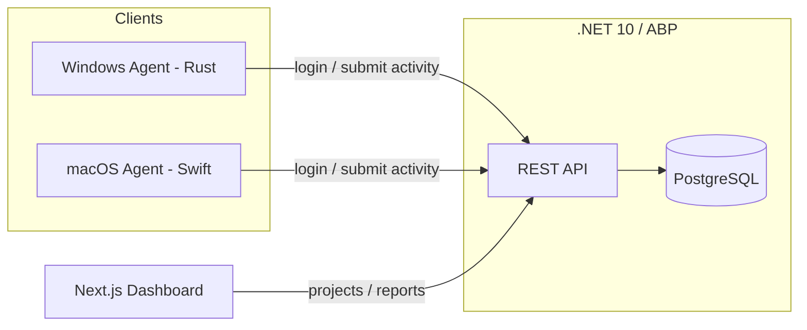

# Dosi-Tracker

An open-source **team activity & time-tracking platform**. Lightweight native
desktop agents capture work activity (screenshots, webcam, active window,
keyboard/mouse counts) and sync it to a backend where managers review projects,
teams, and reports.

This is a **monorepo** containing every part of the product.

## Documentation

| Doc | Language | Contents |
|-----|----------|----------|
| [`DOCUMENTATION.md`](./DOCUMENTATION.md) | English | Product: vision, roles, SaaS, frontend features, host console |
| [`docs/AS_BUILT.md`](./docs/AS_BUILT.md) | English | **What the code actually has today** |
| [`docs/PRODUCTION_READINESS.md`](./docs/PRODUCTION_READINESS.md) | English | Production gap scorecard + build order |
| [`docs/RUNBOOK.md`](./docs/RUNBOOK.md) | English | How to run, health-check, recover (local → future prod) |
| [`docs/SECURITY.md`](./docs/SECURITY.md) | English | Threats, as-built controls, hard rules |
| [`docs/bn/`](./docs/bn/README.md) | **বাংলা** | Full engineering **course** (chs **1–23**) — product + implementation |
| [`ENGINEERING_BLUEPRINT.md`](./ENGINEERING_BLUEPRINT.md) | English | Short index → course + production pack |
| [`ENGINEERING_BLUEPRINT.bn.md`](./ENGINEERING_BLUEPRINT.bn.md) | বাংলা | Short index → `docs/bn/` + production pack |

## Repository layout

```
Dosi-Tracker/
├── backend/            # .NET 10 + ABP Framework (DDD / Clean Architecture), REST API, PostgreSQL
├── frontend/           # Next.js (App Router, TypeScript, Tailwind) web dashboard
├── clients/
│   ├── windows/        # Rust background agent (low RAM / low CPU)
│   └── macos/          # Swift background agent (ScreenCaptureKit / AVFoundation / Accessibility)
├── docs/
│   ├── bn/             # Bengali target engineering course
│   ├── AS_BUILT.md     # Code reality
│   ├── PRODUCTION_READINESS.md
│   ├── RUNBOOK.md
│   └── SECURITY.md
├── DOCUMENTATION.md
├── ENGINEERING_BLUEPRINT.md
└── ENGINEERING_BLUEPRINT.bn.md
```

## Components

| Component | Tech | Purpose |
|-----------|------|---------|
| **Backend** | .NET 10, ABP Framework, EF Core, PostgreSQL | Auth, projects, teams, activities, reports; auto-generated REST API |
| **Frontend** | Next.js, TypeScript, Tailwind CSS | Web dashboard: projects, reports, team management |
| **Windows client** | Rust | Background tracking agent for Windows |
| **macOS client** | Swift | Background tracking agent for macOS |

## Architecture



Both agents share the same design:

- **Offline-first**: snapshots saved to a local SQLite queue, then synced.
- **Event-driven input**: OS pushes keyboard/mouse events → ~0% idle CPU.
- **Interval capture**: heavy work (screenshot/webcam) runs once per interval,
  then the agent sleeps — minimizing RAM/CPU/battery use.
- **Privacy-conscious**: only keyboard/mouse **counts** are collected, never
  keystroke content.

## Getting started

Each component has its own README with setup details:

- [`backend/`](./backend) — run `abp` solution; configure PostgreSQL + run migrations (`Dosi.Tracker.DbMigrator` also seeds the default plans and admin)
- [`frontend/`](./frontend) — `npm install && npm run dev`
- [`clients/windows/`](./clients/windows/README.md) — install Rust, then `cargo run --release`
- [`clients/macos/`](./clients/macos/README.md) — build on a Mac with `swift run`

### One-command stack (Docker)

```bash
dotnet publish backend/src/Dosi.Tracker.DbMigrator -c Release
dotnet publish backend/src/Dosi.Tracker.HttpApi.Host -c Release
docker compose up --build
# API on http://localhost:8080 · dashboard on http://localhost:3000
```

### Tests & CI

- Backend: `dotnet test backend/Dosi.Tracker.slnx` — domain unit tests + app-service
  integration tests on in-memory SQLite.
- CI ([`.github/workflows/ci.yml`](./.github/workflows/ci.yml)) builds and tests the
  backend, typechecks/builds the frontend, `cargo check`s the Windows agent and
  `swift build`s the macOS agent on every push/PR.

### Prerequisites

| Tool | Backend | Frontend | Win client | Mac client |
|------|:-------:|:--------:|:----------:|:----------:|
| .NET 10 SDK | ✅ | | | |
| PostgreSQL | ✅ | | | |
| Node.js 20+ | | ✅ | | |
| Rust (rustup) | | | ✅ | |
| macOS 14+ / Xcode 15+ | | | | ✅ |

## Status

Scaffold / work-in-progress. Backend and frontend are generated from official
templates; the Rust and Swift clients are working skeletons with a clear
module structure ready to be built out.

## License

MIT
