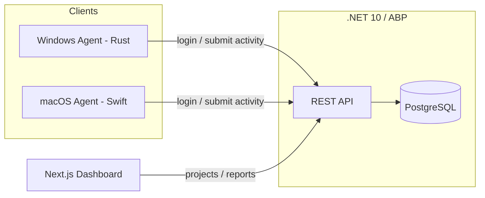

# Dosi-Tracker

An open-source **team activity & time-tracking platform**. Lightweight native
desktop agents capture work activity (screenshots, webcam, active window,
keyboard/mouse counts) and sync it to a backend where managers review projects,
teams, and reports.

This is a **monorepo** containing every part of the product.

## Repository layout

```
Dosi-Tracker/
├── backend/            # .NET 10 + ABP Framework (DDD / Clean Architecture), REST API, PostgreSQL
├── frontend/           # Next.js (App Router, TypeScript, Tailwind) web dashboard
└── clients/
    ├── windows/        # Rust background agent (low RAM / low CPU)
    └── macos/          # Swift background agent (ScreenCaptureKit / AVFoundation / Accessibility)
```

## Components

| Component | Tech | Purpose |
|-----------|------|---------|
| **Backend** | .NET 10, ABP Framework, EF Core, PostgreSQL | Auth, projects, teams, activities, reports; auto-generated REST API |
| **Frontend** | Next.js, TypeScript, Tailwind CSS | Web dashboard: projects, reports, team management |
| **Windows client** | Rust | Background tracking agent for Windows |
| **macOS client** | Swift | Background tracking agent for macOS |

## Architecture



Both agents share the same design:

- **Offline-first**: snapshots saved to a local SQLite queue, then synced.
- **Event-driven input**: OS pushes keyboard/mouse events → ~0% idle CPU.
- **Interval capture**: heavy work (screenshot/webcam) runs once per interval,
  then the agent sleeps — minimizing RAM/CPU/battery use.
- **Privacy-conscious**: only keyboard/mouse **counts** are collected, never
  keystroke content.

## Getting started

Each component has its own README with setup details:

- [`backend/`](./backend) — run `abp` solution; configure PostgreSQL + run migrations
- [`frontend/`](./frontend) — `npm install && npm run dev`
- [`clients/windows/`](./clients/windows/README.md) — install Rust, then `cargo run --release`
- [`clients/macos/`](./clients/macos/README.md) — build on a Mac with `swift run`

### Prerequisites

| Tool | Backend | Frontend | Win client | Mac client |
|------|:-------:|:--------:|:----------:|:----------:|
| .NET 10 SDK | ✅ | | | |
| PostgreSQL | ✅ | | | |
| Node.js 20+ | | ✅ | | |
| Rust (rustup) | | | ✅ | |
| macOS 14+ / Xcode 15+ | | | | ✅ |

## Status

Scaffold / work-in-progress. Backend and frontend are generated from official
templates; the Rust and Swift clients are working skeletons with a clear
module structure ready to be built out.

## License

MIT
