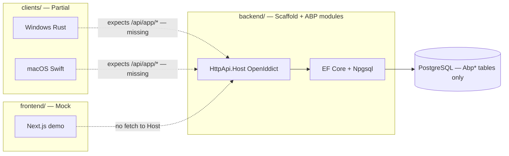

# As-Built — What Exists in the Repo Today

> **Not** the target course in [`docs/bn/`](./bn/README.md).  
> This file is the **as-built inventory** audited against code.  
> Product UX story: [`../DOCUMENTATION.md`](../DOCUMENTATION.md) §21.  
> Gaps / readiness: [`PRODUCTION_READINESS.md`](./PRODUCTION_READINESS.md).

**Audit date:** 2026-07-16

---

## Status legend

| Label | Meaning |
|-------|---------|
| **Implemented** | Works in-repo for the stated scope |
| **Partial** | Real code; incomplete or not end-to-end |
| **Scaffold** | Template / placeholders only |
| **Mock** | Demo UI / localStorage; not backed by API |
| **Not present** | No implementation in this repo |

---

## System map (as-built)

Agents and the web app **do not** form a working production pipeline yet.

---

## 1. Backend

| Item | Status | Evidence |
|------|--------|----------|
| ABP layered solution (.NET 10) | Implemented | `backend/src/*`, `Dosi.Tracker.slnx` |
| EF Core + PostgreSQL (Npgsql) | Implemented | `TrackerEntityFrameworkCoreModule`, `ConnectionStrings:Default` |
| OpenIddict + Identity + Tenants | Implemented | Host module + seed contributors |
| Initial migration (`Abp*`, `OpenIddict*`) | Implemented | `.../Migrations/20260714093733_Initial.cs` |
| Health checks | Implemented | `/health-status`, HealthChecks UI |
| Serilog (console + file) | Implemented | Host `Program.cs` / `appsettings.json` |
| Dockerfiles (Host, DbMigrator) | Implemented | under `HttpApi.Host/`, `DbMigrator/` |
| Product entities (Activity, Project, …) | **Not present** | `TrackerDbContext` has Identity/Tenant DbSets only |
| Product app services / Auto API | **Scaffold** | `TrackerAppService`, empty `TrackerPermissions` |
| Hangfire / Redis / SignalR | **Not present** | — |

### DbContext (as-built)

Custom product `DbSet`s: **none**.

Present: `Users`, `Roles`, `ClaimTypes`, `OrganizationUnits`, `SecurityLogs`, `LinkUsers`, `UserDelegations`, `Sessions`, `Tenants`, `TenantConnectionStrings` — plus module configuration for Permissions, Settings, BackgroundJobs, AuditLogging, FeatureManagement, OpenIddict, BlobStoring.

### Auth (as-built)

- **Server:** OpenIddict validation on HttpApi.Host (not a hand-rolled JWT-only stack).
- **Default Host URL:** `https://localhost:44342` (`App:SelfUrl`).
- Agents default to `https://localhost:44300` in examples — **port mismatch** with Host.

### Config keys (Host)

| Key | Role |
|-----|------|
| `ConnectionStrings:Default` | PostgreSQL |
| `App:SelfUrl` | Public API URL |
| `App:HealthCheckUrl` | `/health-status` |
| `AuthServer:Authority` | OpenIddict authority |
| `AuthServer:CertificatePassPhrase` | Dev cert |
| `StringEncryption:DefaultPassPhrase` | ABP string encryption |
| `Serilog:*` | Logging |

---

## 2. API surface

### What agents call (client-defined; **no matching app services**)

| Method | Path | Backend |
|--------|------|---------|
| `POST` | `/api/app/account/login` | **Missing** (OpenIddict token endpoints exist separately) |
| `GET` | `/api/app/project/my-projects` | **Missing** |
| `POST` | `/api/app/activity` | **Missing** |

Client code: `clients/windows/src/api.rs`, `clients/macos/.../ApiClient.swift`.

### What ABP template typically exposes

Account / Identity / Tenant Management / Permission / Setting / Feature management via ABP modules (Swagger on Host when running). **Not** the product Activity/Project contracts described in the Bengali course.

**Target contracts:** [`docs/bn/17-api-documentation.md`](./bn/17-api-documentation.md)  
**Target schema:** [`docs/bn/16-database-design.md`](./bn/16-database-design.md)

---

## 3. Frontend

| Item | Status | Paths |
|------|--------|-------|
| Next.js dashboard (tenant + host) | Implemented (demo) | `frontend/src/app/**` |
| Roles / RoleGuard / sidebar ACL | Implemented (client-side) | `lib/roles.ts`, `components/role-guard.tsx` |
| Deterministic mock data | Implemented | `lib/mock-data.ts`, `tenant-data.ts`, `saas-data.ts`, `host-data.ts`, … |
| Session | **Mock** | `localStorage` keys `dosi-user`, `dosi-workspace`, … |
| Calls to backend API | **Not present** | No wired `fetch` / ABP proxy for domain data |

---

## 4. Desktop agents

| Item | Windows | macOS |
|------|---------|-------|
| Capture (screenshot, input counts, active window, webcam) | Partial | Partial |
| SQLite offline queue | Partial | Partial |
| HTTP client for login / projects / activity | Partial (calls missing APIs) | Same |
| Tray / service packaging / auto-update | Not present / incomplete | Same |

---

## 5. DevOps & ops

| Item | Status |
|------|--------|
| `docker-compose` | **Not present** |
| `.github/workflows` CI | **Not present** |
| Production deploy automation | **Not present** |
| ABP Studio migrate scripts | Present — `backend/etc/scripts/` |
| Monitoring beyond Serilog + health | **Not present** (no Grafana/Prometheus stack in repo) |

---

## Primary stack (canonical)

Document and build against this only; alternatives belong in course appendices:

| Layer | Canonical |
|-------|-----------|
| Web | Next.js |
| API | .NET 10 + ABP |
| DB | PostgreSQL |
| Agents | Rust (Windows), Swift (macOS) |

Avalonia / SQL Server appear in course text as **alternatives**, not as-built.
