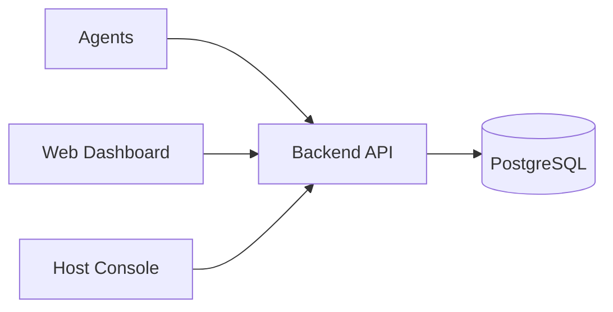

# অধ্যায় ১: Product Vision & Idea

> **Status:** Implemented (product vision + demo UI).  
> **As-built:** Web demo reflects this vision; backend ingest not wired — [`../AS_BUILT.md`](../AS_BUILT.md).  
> **English SSOT:** [`../../DOCUMENTATION.md`](../../DOCUMENTATION.md) section 1.

> **Canonical:** কেন Dosi-Tracker, তিন অংশ, ডিজাইন নীতি, কী বানাবো না।  
> Architecture → [০৪](./04-system-architecture.md) · Roles → [০২](./02-personas-roles.md) · SaaS → [০৩](./03-saas-multi-tenancy.md)

---

## সমস্যা

বিক্ষিপ্ত বা অফিস টিমের জন্য দরকার: কাজের সময় **কোথায় যাচ্ছে** — কোন প্রজেক্ট, কোন অ্যাপ, কত ফোকাস — **কম ঘর্ষণে**, **ভারী spyware ছাড়া**, এবং **কীস্ট্রোক কনটেন্ট সংগ্রহ ছাড়া**।

Employee monitoring অনেক সময় ভুল বোঝায়:

| ভয় | Dosi-Tracker উত্তর |
|-----|-------------------|
| Keylogger | শুধু **count**, কনটেন্ট নয় |
| ব্যাটারি/CPU খেয়ে ফেলা | Native agent + interval capture + idle sleep |
| সব স্ক্রিন পাবলিক | Private storage + blur policy (লক্ষ্য) |
| এক কোম্পানির ডেটা অন্যে | Multi-tenant isolation |

মূল বার্তা: **সিগন্যাল**, কনটেন্ট নয়।

---

## সমাধান — তিন অংশ

| অংশ | কাজ | কোথায় বিস্তারিত |
|-----|-----|------------------|
| **Desktop Agent** | Screenshot, active window, apps, keyboard/mouse **count** | [১৫](./15-desktop-agent.md) |
| **Web Dashboard** | Live activity, monitor, projects, timesheet, reports | [১০](./10-tenant-features.md) |
| **SaaS Platform** | Tenant workspace, plan, billing, Host Console | [০৩](./03-saas-multi-tenancy.md), [১১](./11-platform-settings.md) |

End-to-end data path → [০৪](./04-system-architecture.md)।

---

## ডিজাইন নীতি

| নীতি | বাস্তবে | Feature ম্যাপ |
|------|--------|---------------|
| **Privacy-first** | Counts only; optional blur | Settings tracking [১০](./10-tenant-features.md) |
| **Efficiency-first** | Event-driven input, interval capture | Agent [১৫](./15-desktop-agent.md) |
| **Multi-tenant by default** | Data never crosses tenants | [০৩](./03-saas-multi-tenancy.md), [১৩](./13-multi-tenant-isolation.md) |
| **Role-appropriate views** | Owner/Admin/Worker/Client | [০২](./02-personas-roles.md) |
| **Deterministic demo** | Explore without backend | `mock-data.ts` + DOCUMENTATION §19 |

---

## কী বানাবো না (সচেতন সীমা)

1. Keystroke / clipboard **content** logging  
2. Hidden silent agent without policy disclosure (product ethics)  
3. Agent → DB direct write (সবসময় API)  
4. Day-1 microservices ([২৩](./23-roadmap.md))  
5. Public screenshot URLs  

---

## সফলতার সংজ্ঞা (MVP → production)

| ধাপ | মানে “কাজ করছে” |
|-----|----------------|
| **Demo MVP** | Web UI সব role দিয়ে explore — আজকের অবস্থা |
| **Vertical slice** | Agent → API → DB → Dashboard এক activity দেখায় |
| **Production** | Auth, tenant filter, storage, backup, CI — [`../PRODUCTION_READINESS.md`](../PRODUCTION_READINESS.md) |

---

## কোর্সে পরের ধাপ

1. [০২](./02-personas-roles.md) — কে কী দেখে  
2. [০৩](./03-saas-multi-tenancy.md) — workspace, plan, billing  
3. [০৪](./04-system-architecture.md) — সিস্টেমের মেরুদণ্ড  
4. Demo অ্যাকাউন্ট: [`DOCUMENTATION.md`](../../DOCUMENTATION.md) §19
