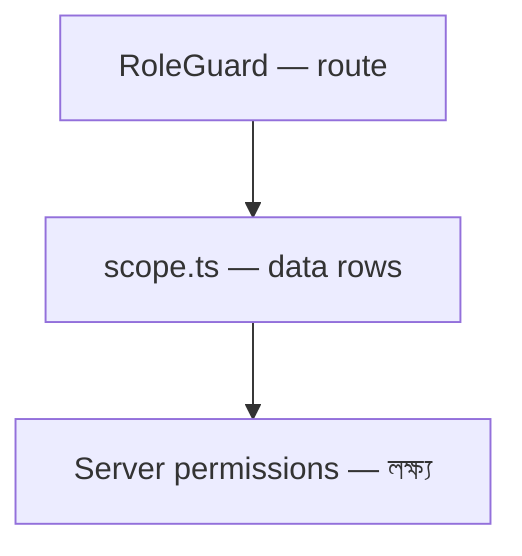

# অধ্যায় ২: Personas & Roles

> **Status:** Implemented (frontend demo — `roles.ts`, `RoleGuard`).  
> **As-built:** Client-side only; server RBAC not built — [`../SECURITY.md`](../SECURITY.md).  
> **English SSOT:** [`../../DOCUMENTATION.md`](../../DOCUMENTATION.md) section 2.

> **Canonical:** পাঁচ role, access matrix, Owner vs Admin, scoping rules।  
> SaaS → [০৩](./03-saas-multi-tenancy.md) · Features → [১০](./10-tenant-features.md) · Security → [১৮](./18-security-architecture.md)

---

## পাঁচটি Role

চারটি role **এক tenant-এর ভিতরে**; একটি **পুরো platform** চালায়।

| Role | Scope | Persona | মূল কাজ |
|------|-------|---------|---------|
| **host** | সব tenant | SaaS operator | Tenants, plans, revenue, global users; impersonate |
| **owner** | এক tenant | Founder / lead | Admin সব + **billing & plan** |
| **admin** | এক tenant | Team manager | Members, projects, monitor, reports — **billing নয়** |
| **worker** | এক tenant (self) | Contributor | নিজের activity, timesheet, assigned projects |
| **client** | এক tenant (read-only) | External stakeholder | Assigned project progress only |

কোড: `frontend/src/lib/types.ts`, `frontend/src/lib/roles.ts`।

---

## Owner vs Admin

| | Owner | Admin |
|-|-------|-------|
| Team / projects / monitor | ✅ | ✅ |
| Reports / insights | ✅ | ✅ |
| Tracking settings | ✅ | ✅ |
| `/billing` (plan, seats, invoices) | ✅ | ❌ |
| Change subscription | ✅ | ❌ |

Production: invite UI যেন Admin→Owner escalate না করে। Server-এ `Billing.Manage` শুধু Owner।

---

## Route access matrix

`navAccess` + `RoleGuard` (`components/role-guard.tsx`):

| Route | host | owner | admin | worker | client |
|-------|:----:|:-----:|:-----:|:------:|:------:|
| `/host/*` | ✅ | | | | |
| `/dashboard` | | ✅ | ✅ | ✅ | ✅ |
| `/projects` | | ✅ | ✅ | ✅ | |
| `/team` | | ✅ | ✅ | | |
| `/monitor` | | ✅ | ✅ | ✅ (self) | |
| `/activities`, `/screenshots` | | ✅ | ✅ | ✅ | ✅ |
| `/timesheet` | | ✅ | ✅ | ✅ | |
| `/reports`, `/insights` | | ✅ | ✅ | | |
| `/billing` | | ✅ | | | |
| `/settings` | | ✅ | ✅ | ✅ | ✅ |

Landing (`landingFor`): `host → /host`, বাকি → `/dashboard`।

---

## দুই স্তরের নিয়ন্ত্রণ

1. **Route guard** — পেজে ঢুকতে পারবে কি না  
2. **Data scope** — কোন rows দেখবে (worker = self)  
3. **Server** — production-এ একমাত্র সত্য; UI bypass করা যায়  

Known demo gaps (timesheet scope, admin tracking inconsistency) → [`../PRODUCTION_READINESS.md`](../PRODUCTION_READINESS.md)।

---

## Persona → primary jobs (উদাহরণ)

| Persona | প্রথম লগইনে কী করে |
|---------|-------------------|
| Host | `/host` — MRR, new tenants, impersonate support |
| Owner | Dashboard KPIs → Billing seats → invite team |
| Admin | Team + Monitor + Reports |
| Worker | Own dashboard → My timesheet → assigned projects |
| Client | Client dashboard — project progress only |

---

## Backend mapping (লক্ষ্য)

| Frontend `role` | ABP |
|-----------------|-----|
| host | Host-side admin + Host permissions |
| owner / admin / worker / client | Tenant roles + fine-grained permissions |

Anti-pattern: `if (role == "admin")` ছড়িয়ে।  
Correct: `CheckAsync(Permission)` — [১৮](./18-security-architecture.md)।
