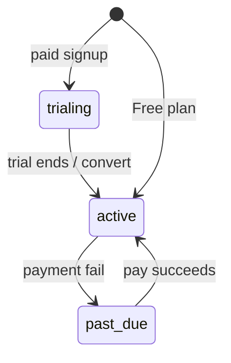

# অধ্যায় ৩: SaaS & Multi-Tenancy Model

> **Status:** Implemented (frontend demo — `saas-data.ts`). Backend tenant module scaffold only.  
> **As-built:** [`../AS_BUILT.md`](../AS_BUILT.md) · DB tenant strategy → [১৬](./16-database-design.md).

> **Canonical:** Workspace, Plan, subscription lifecycle, usage math।  
> Host Console UI → [`DOCUMENTATION.md`](../../DOCUMENTATION.md) §11 · Host settings → [১১](./11-platform-settings.md) · Isolation → [১৩](./13-multi-tenant-isolation.md)

---

## মূল ধারণা

Dosi-Tracker = **B2B SaaS**। মূল noun = **Workspace** (= **Tenant**)।

| Concept | অর্থ |
|---------|------|
| **Workspace** | এক কোম্পানির isolated world: members, projects, activities, billing |
| **Plan** | Free / Starter / Business / Enterprise + limits |
| **Owner** | Subscription ধরে; seats/plan বদলায় |
| **Host** | সব workspace platform থেকে চালায় |

প্রতিটি activity/project row-এ শেষ পর্যন্ত `tenant_id` থাকবে — [১৬](./16-database-design.md)।

---

## Plans (demo seed)

`frontend/src/lib/saas-data.ts`:

| Plan | Price/user/mo | Seats | Projects | Storage | Retention |
|------|--------------:|------:|---------:|--------:|----------:|
| Free | $0 | 3 | 2 | 1 GB | 7 days |
| Starter | $6 | 10 | 10 | 20 GB | 30 days |
| Business | $12 | 50 | ∞ | 500 GB | 180 days |
| Enterprise | Custom | ∞ | ∞ | ∞ | 365 days |

Business = “Popular” highlight demo UI-তে।

---

## Subscription lifecycle



| Status | UI / Host |
|--------|-----------|
| `trialing` | ১৪ দিন trial banner |
| `active` | Normal |
| `past_due` | Host Console-এ **Suspended** |

---

## Usage & billing math

```
monthlyCost(ws) = plan.pricePerUser × seatsUsed
// Enterprise = custom / null
```

Meters: seats, projects, storage, retention — `used` vs `plan.limit` (`usagePct`, `fmtLimit`)।

| Invoice pattern | কখন |
|-----------------|-----|
| One `upcoming` | Workspace `trialing` |
| Recent `paid` list | Workspace `active` |

Tenant Billing page → [১০](./10-tenant-features.md)।  
Team invite **seat limit**-এ disable — UI side of this model।

**Known drift:** Team page live seat count vs Billing `workspace.seatsUsed` — এক source রাখুন (API wire-এ)।

---

## Host vs Tenant views

| View | ডেটা |
|------|------|
| Tenant `/billing` | এই workspace-এর plan + invoices |
| Host `/host/billing` | সব tenant roll-up (MRR, collected) |
| Host `/host/tenants` | plan change, suspend, delete |

Host UI বিস্তারিত → DOCUMENTATION §11 (এখানে টেবিল duplicate নয়)।

---

## Backend mirror (লক্ষ্য)

| Demo | Production |
|------|------------|
| `saas-data.ts` workspaces | ABP `Tenant` + subscription metadata |
| Plan limits in JS | Editions / Features + enforcement jobs |
| `localStorage` patches | API is source of truth |
| Frontend isolation | `tenant_id` + global query filter |

আজ: ABP tenant tables migrate হয়; product entities এখনো নেই — [`../AS_BUILT.md`](../AS_BUILT.md)।
