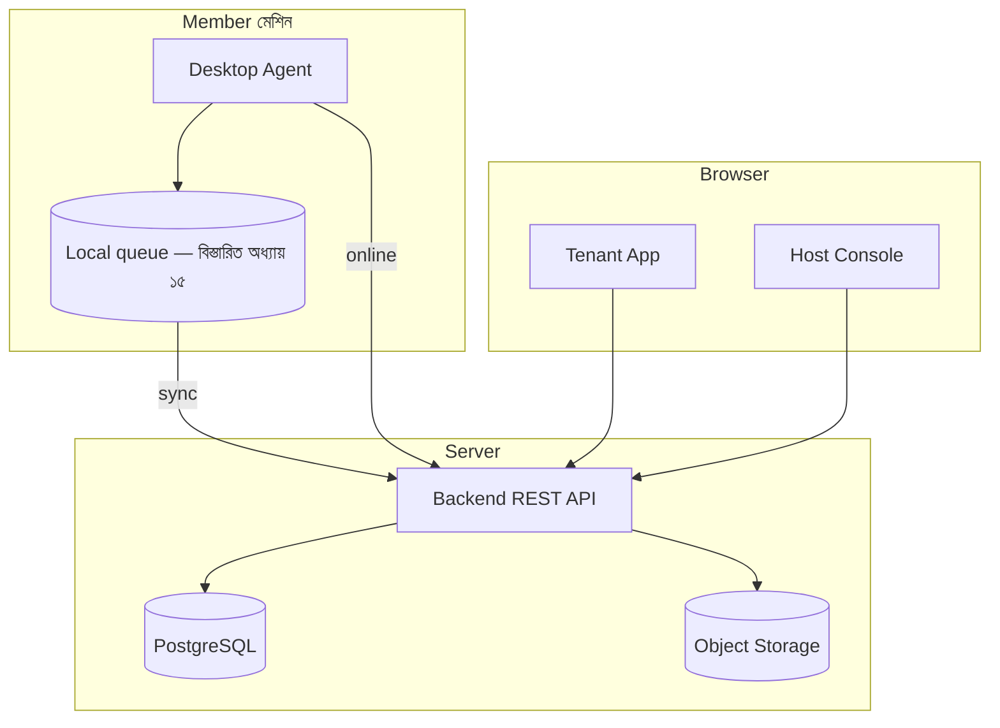
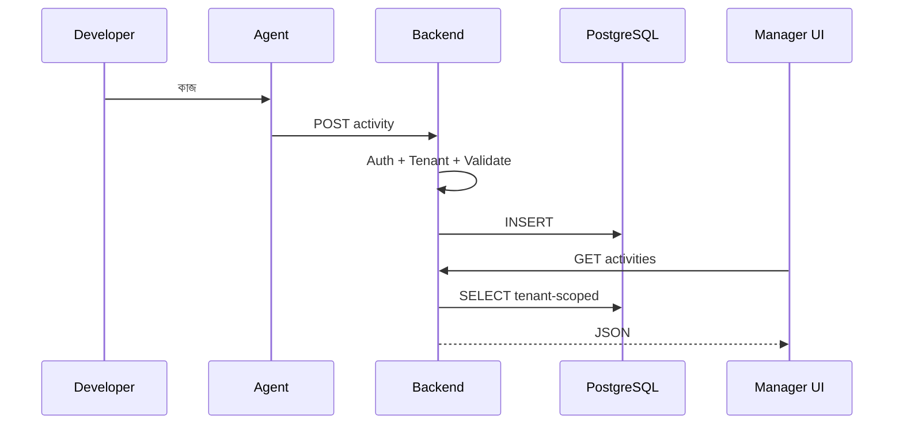
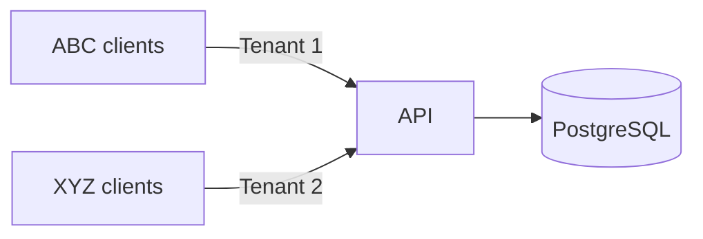

# অধ্যায় ৪: System Architecture

> **Status:** Target design (teaching overview).  
> **As-built:** Components exist but are not wired end-to-end — see [`../AS_BUILT.md`](../AS_BUILT.md).  
> **Readiness:** [`../PRODUCTION_READINESS.md`](../PRODUCTION_READINESS.md)

> পুরো Dosi-Tracker-এর **মেরুদণ্ড**। এখানে শুধু: অংশগুলো কী, কারা কার সাথে কথা বলে,
> ডেটা কোন পথে যায়।  
> Vision → [০১](./01-product-vision.md) · Roles → [০২](./02-personas-roles.md) · SaaS → [০৩](./03-saas-multi-tenancy.md) ·  
> Offline sync → [১৫](./15-desktop-agent.md) · Schema → [১৬](./16-database-design.md) · Stack → [০৫](./05-technology-stack.md)

---

## System Architecture কী?

সফটওয়্যারের **Blueprint** যা বলে:

1. কোন Component কী কাজ করবে?
2. কোন Component কার সাথে যোগাযোগ করবে?
3. ডেটা কোথায় যাবে, কোন ক্রমে?
4. User মেশিন থেকে Manager Dashboard পর্যন্ত পথ কী?

খারাপ architecture পরে rewrite বাধ্য করে। Dosi-Tracker শুরু থেকে **স্তর আলাদা** ও
**স্পষ্ট নিয়ম** দিয়ে ডিজাইন।

---

## চারটি প্রধান অংশ

```
Desktop Agent  ──HTTPS API──►  Backend (.NET 10 + ABP)
                                      │
                                      ▼
                               PostgreSQL (+ Object Storage)
                                      ▲
Web Dashboard (Tenant + Host) ──API───┘
```



### অলঙ্ঘনীয় নিয়ম

| নিয়ম | কারণ |
|------|------|
| Agent → DB সরাসরি নয় | credential/validation/tenant বাইপাস রোধ |
| Dashboard → Agent সরাসরি নয় | NAT/firewall; কেন্দ্রীয় auth |
| Dashboard → DB সরাসরি নয় | একই কারণ |
| প্রতিটি write-এ tenant context | কোম্পানির ডেটা মিশবে না |

---

## অংশ ১ — Desktop Agent (ভূমিকা)

User PC-তে native app (Windows/macOS)। কাজ: সিগন্যাল সংগ্রহ → queue/API।

**সংগ্রহ করে:** active window, running apps, mouse/keyboard **count**, screenshot
(permission মতো), idle time।

**উদাহরণ snapshot**

```
09:00 | Visual Studio Code | Hospital Management System
Keyboard: 350 hits | Mouse: 170 clicks
```

**করবে না:** SQL লেখা, অন্য user দেখা, keystroke কন্টেন্ট ধরা, Dashboard UI।

> Tracker, SQLite, sync, installer, auto-update — সম্পূর্ণ: [অধ্যায় ১৫](./15-desktop-agent.md)

---

## অংশ ২ — Backend (.NET 10 + ABP) (ভূমিকা)

সব Agent/Web traffic এখানে। Backend করে: Authentication, Authorization,
Tenant resolve, Validation, Persist, Reports, file upload orchestration, jobs, audit।

> Layering, ABP modules, “কেন .NET/ABP” — [অধ্যায় ৫](./05-technology-stack.md)  
> Permission/JWT বিস্তারিত — [অধ্যায় ১৮](./18-security-architecture.md)  
> REST surface — [অধ্যায় ১৭](./17-api-documentation.md)

---

## অংশ ৩ — PostgreSQL (ভূমিকা)

Validation-এর পর কেন্দ্রীয় store। Activities-এর মতো টেবিলে `TenantId`, `UserId`,
`ProjectId`, সময়সীমা, productivity, input counts; screenshot **binary নয়** —
storage URL।

> সম্পূর্ণ ER, column, index, retention — [অধ্যায় ১৬](./16-database-design.md)

---

## অংশ ৪ — Web Dashboard (ভূমিকা)

দুটি পৃষ্ঠ:

1. **Tenant App** — owner / admin / worker / client  
2. **Host Console** — platform Super Admin  

শুধু API ডাকে। Role ও page বিস্তারিত → [`DOCUMENTATION.md`](../../DOCUMENTATION.md)

Host-এর global config UI → [অধ্যায় ১১](./11-platform-settings.md)

---

## End-to-end: একটি Activity কীভাবে Dashboard-এ আসে

| ধাপ | কী ঘটে |
|----:|--------|
| 1 | User VS Code-এ কাজ করে |
| 2 | Agent app/window/সময় শনাক্ত করে |
| 3 | Mouse/keyboard count নেয় |
| 4 | Screenshot নেয় (অনুমতি থাকলে) |
| 5 | `POST /api/.../activities` (বা offline হলে পরে sync) |
| 6 | Backend JWT + tenant + validate |
| 7 | DB insert + storage metadata |
| 8 | Manager `GET` dashboard/activities |
| 9 | UI-তে দেখা যায় |



Offline হলে ধাপ ৫ আগে local queue — প্রবাহের বিস্তারিত [অধ্যায় ১৫](./15-desktop-agent.md)।

---

## কেন API? (সরাসরি DB নয়)

**সরাসরি DB-এর সমস্যা:** প্রতি Agent-এ password; validation নেই; tenant বাইপাস;
schema পরিবর্তন ভাঙে; audit/rate-limit অসম্ভব; DB পোর্ট ইন্টারনেটে খোলা।

**API দিলে:** Authentication, Authorization, Validation, Logging, Rate limiting,
Audit, Versioning, horizontal scale।

এটি Enterprise SaaS-এর মূল সিদ্ধান্ত — বাকি অধ্যায় এই সিদ্ধান্তের উপর দাঁড়ায়।

---

## Offline ও Multi-tenant — সংক্ষিপ্ত ধারণা

**Offline-first:** নেট না থাকলে queue → পরে API। হারায় না।  
বিস্তারিত বাস্তবায়ন: [অধ্যায় ১৫](./15-desktop-agent.md)

**Multi-tenant:** ABC = TenantId 1, XYZ = TenantId 2; প্রতি query-তে filter।  
Schema ও index: [অধ্যায় ১৬](./16-database-design.md) ·  
Security enforce: [অধ্যায় ১৮](./18-security-architecture.md)



---

## এই Architecture কেন ভালো

| সুবিধা | কীভাবে |
|--------|--------|
| Security | DB শুধু Backend |
| Scalability | Stateless API replicas |
| Maintainability | Agent / API / Web আলাদা deploy |
| Performance | Agent হালকা; ভারী কাজ server |
| Extensibility | পরে Mobile/Public API একই Backend |

### এড়ানোর ভুল

| ভুল | সঠিক |
|-----|------|
| Agent→SQL | Agent→API |
| Business logic শুধু Frontend | Backend |
| TenantId ছাড়া shared tables | সবদা TenantId + filter |
| Offline না রাখা | Queue + sync |

---

## সারসংক্ষেপ

চার অংশ: Agent → API → DB/Storage → Dashboard। API-mediated, tenant-aware,
offline-capable। পরের অধ্যায়গুলো এই কাঠামোর **গভীর বাস্তবায়ন** — এখানে আর
পুনরাবৃত্তি নয়।

→ [অধ্যায় ৫ — Technology Stack](./05-technology-stack.md)
