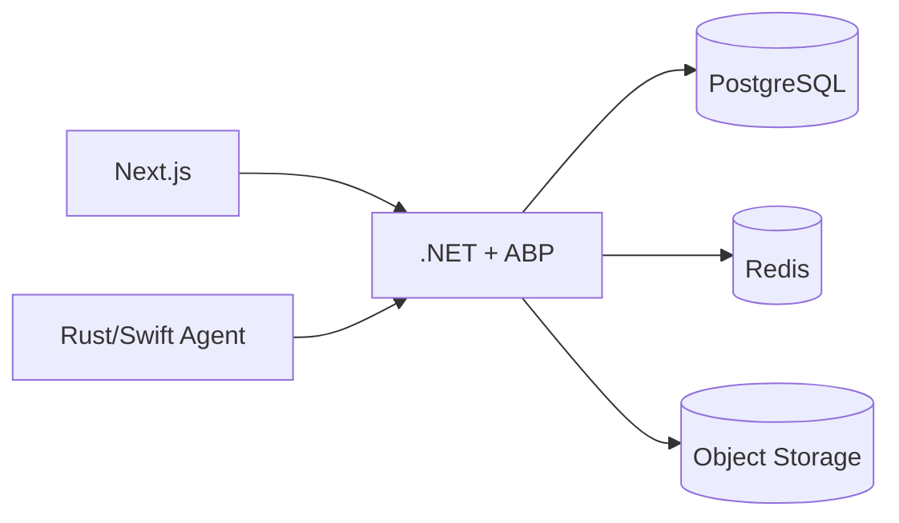

# অধ্যায় ৫: Technology Stack

> **Status:** Target design (why tools). Canonical stack = Next.js + ABP + PostgreSQL + Rust/Swift.  
> **As-built:** Stack partially present; Hangfire/Redis/etc. not in repo — [`../AS_BUILT.md`](../AS_BUILT.md).

> **Canonical:** টুল নির্বাচনের যুক্তি। বাস্তবায়ন বিস্তারিত অন্য অধ্যায়ে।  
> Architecture → [০৪](./04-system-architecture.md) · Agent how-to → [১৫](./15-desktop-agent.md) · DB → [১৬](./16-database-design.md)

---

## Technology Stack কী?

প্রজেক্টের স্তরভিত্তিক টুলসেট। নির্বাচনের মানদণ্ড: Agent performance, multi-tenant
SaaS (ABP), type safety, security, পরে scale।

---

## এক নজরে (ম্যাপ)

| স্তর | প্রযুক্তি | এই অধ্যায়ে | বিস্তারিত বাস্তবায়ন |
|------|----------|-------------|---------------------|
| Web UI | Next.js, React, TypeScript, Tailwind, Recharts | কেন | [`DOCUMENTATION.md`](../../DOCUMENTATION.md) |
| Backend | .NET 10, ABP, EF Core | কেন + layers | [১৭](./17-api-documentation.md), [১৮](./18-security-architecture.md) |
| DB | PostgreSQL | কেন (+ SQL Server বিকল্প) | [১৬](./16-database-design.md) |
| Cache | Redis | কেন | Config: [১১](./11-platform-settings.md); Prod: [২১](./21-deployment.md) |
| Jobs | Hangfire / ABP Jobs | কেন | Schedules: [১১](./11-platform-settings.md) |
| Realtime | SignalR | কেন | Prod backplane: [২১](./21-deployment.md) |
| Win Agent | Rust | কেন | [১৫](./15-desktop-agent.md) |
| Mac Agent | Swift | কেন | [১৫](./15-desktop-agent.md) |
| Agent local | SQLite | কেন | [১৫](./15-desktop-agent.md) |
| Files | S3 / Azure / GCS / Local | কেন | [১১](./11-platform-settings.md) |
| CI/CD | Docker, GitHub Actions… | সংক্ষেপ | [১৯](./19-devops-cicd.md) |



---

## Frontend — Next.js + React + TypeScript

**Next.js (App Router):** Tenant routes ও Host routes এক অ্যাপে; modern routing;
production build সহজ।

**React:** জটিল interactive UI (filters, charts, drawers, role views)।

**TypeScript:** Role/DTO/API shape compile-time; Backend contract-এর সাথে মিল।

**Tailwind + CSS variables:** দ্রুত UI, light/dark token, consistent design system।

**Recharts:** Dashboard/report charts declarative।

প্রোডাক্ট পেজ ও role matrix এই স্ট্যাক দিয়ে ইতিমধ্যে demo আছে —
[`DOCUMENTATION.md`](../../DOCUMENTATION.md)।

---

## Backend — .NET 10 + ABP + EF Core

**এবং .NET 10:** high performance, C# typing, async, Windows/Linux/Docker।

**ABP কেন (এখানে শুধু সুবিধার তালিকা):**

| ABP capability | Dosi-Tracker ব্যবহার |
|----------------|---------------------|
| Multi-tenancy | Workspace isolation |
| Identity | Login, lockout, reset |
| Permissions | Owner/Admin/Worker/Client/Host |
| Editions/Features | Plan gates |
| Audit logging | কে কী করেছে |
| Auto API | Application services → REST |
| Background jobs | Email/cleanup hooks |
| Localization | en/bn… |
| DDD layering | Domain → Application → EF → Host |

**Layer স্কেচ (বিস্তারিত কোড কাঠামো Backend README/ABP template):**

```
Domain.Shared → Domain → Application.Contracts → Application
Domain → EntityFrameworkCore → Host / DbMigrator
Application.Contracts → HttpApi
```

**EF Core:** LINQ, migrations, UoW — PostgreSQL provider।

---

## PostgreSQL (এবং SQL Server বিকল্প)

Open-source, শক্তিশালী indexing/concurrency, managed cloud সহজ।  
Windows-only দোকানে SQL Server সম্ভব — Architecture এক; provider/connection আলাদা।

টেবিল ডিজাইন এখানে নয় → [১৬](./16-database-design.md)।

---

## Redis — কেন Cache আলাদা

Multi-instance API-তে in-memory cache share হয় না। Redis:

- Hot dashboard fragments  
- Rate-limit counters  
- Data Protection keys  
- SignalR backplane (deploy অধ্যায়ে)

**বাধ্যতামূলক:** cache key-এ `TenantId` — নাহলে cross-tenant leak।  
Host থেকে provider/TTL সেট: [১১](./11-platform-settings.md)।

---

## Hangfire / Background Jobs — কেন

HTTP request-এ ভারী কাজ নয়। Jobs: screenshot post-process, email, report,
retention cleanup, invoice generation।

কোন job কখন চলবে (cron) — Platform Settings [১১](./11-platform-settings.md)।  
Production dashboard lock — [২১](./21-deployment.md)।

---

## SignalR — কেন

Live activity feed / presence — polling-এর চেয়ে efficient।  
Multi-node এ Redis backplane দরকার — সেটা deploy অধ্যায়ের বিষয়।

---

## Desktop Agent stack — কেন কোন ভাষা

| পথ | কেন |
|----|-----|
| **Rust (Windows)** | কম RAM/CPU, memory-safe systems code |
| **Swift (macOS)** | ScreenCaptureKit / Accessibility native |
| **SQLite local** | Offline queue, durable |
| **Avalonia/.NET (বিকল্প)** | এক ভাষার টিম; MVVM UI+worker — tradeoff: Rust-এর মতো সর্বনিম্ন resource নয় |

কীভাবে track/sync/install — **শুধু** [১৫](./15-desktop-agent.md) (এখানে পুনরাবৃত্তি নেই)।

---

## Object Storage — কেন DB নয়

Screenshot binary DB-তে রাখলে backup/query ধ্বংস। DB = metadata/URL; binary = S3/Azure/GCS/Local।  
Provider ও retention config → [১১](./11-platform-settings.md)।

---

## Auth primitives (সংক্ষেপ)

Identity + JWT access + refresh + permission claims।  
গভীর threat model ও OWASP → [১৮](./18-security-architecture.md)।  
Endpoint তালিকা → [১৭](./17-api-documentation.md)।

---

## DevOps টুল (শুধু নাম)

Docker, Compose, GitHub Actions/TeamCity, Serilog, Prometheus, Grafana, OpenTelemetry —
কেন CI দরকার ও কীভাবে pipeline → [১৯](./19-devops-cicd.md) · [২২](./22-monitoring.md)।

---

## কেন এই combination

Agent হালকা + Backend শক্তিশালী SaaS primitives + আধুনিক Web + API-mediated extensibility
(Mobile/Public API পরে)। প্রতিটি টুল এক সমস্যা সমাধানে — অতিরিক্ত ফ্রেমওয়ার্ক নয়।

→ [অধ্যায় ১১ — Platform Settings](./11-platform-settings.md) · অথবা সরাসরি [১৫ Agent](./15-desktop-agent.md)
