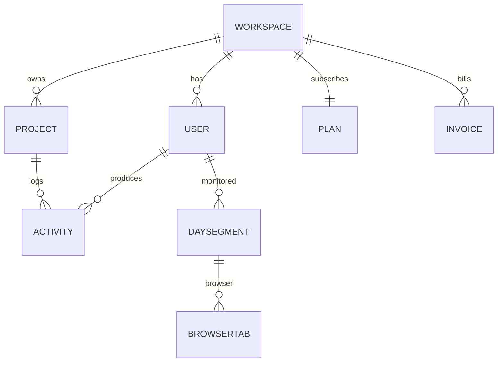

# অধ্যায় ৮: Domain & Data Model

> **Status:** Implemented (frontend types + mock). Backend product entities **missing**.  
> **As-built:** [`../AS_BUILT.md`](../AS_BUILT.md) · Target SQL → [১৬](./16-database-design.md).

> **Canonical:** Tenant domain entities, SaaS entities, relations, field lists।  
> Productivity → [০৯](./09-productivity-model.md) · API DTOs → [১৭](./17-api-documentation.md)

---

## ER (conceptual)



কোড: `types.ts` (tenant), `saas-data.ts` (SaaS)।

---

## Tenant domain — fields

### User
```
id, name, email, role, designation,
status (active | idle | offline),
timezone, trackedToday (min),
productivity (0–100), joinedAt
```

### Project
```
id, title, color, archived,
intervalMinutes,
permissions (TrackingPermissions),
memberIds[],
loggedWeek, loggedMonth, loggedTotal
```

`TrackingPermissions` — screenshot/webcam/keyboard/… per project (Settings-এর সাথে align)।

### Activity
```
userId, projectId, startedAt, endedAt,
description, productivity,
mouseClicks, keyboardHits,
activeWindows[], runningPrograms[],
screen (ScreenMock), hasWebcam, online
```

Agent ingest-এ অতিরিক্ত: `clientActivityId` (idempotent) — [১৫](./15-desktop-agent.md)।

### DaySegment (monitor)
```
type (work | meeting | break | idle),
startMin, endMin, app, windowTitle, projectId,
productivity, mouse/keyboard counts, screen
```

Browser হলে **`BrowserTab[]`**: `title, domain, url, minutes, category, color`।

---

## SaaS domain

| Type | মূল fields |
|------|-----------|
| **Plan** | pricePerUser, seats, projects, storage, retention |
| **Workspace** | id, name, slug, planId, status, seatsUsed, projectsUsed, storageUsedGb, cycleDays, isPrimary? |
| **Invoice** | amount, status (paid/upcoming), period |
| **UsageMetric** | used vs limit |

Plan tables → [০৩](./03-saas-multi-tenancy.md)।

---

## Host domain (computed, not stored)

`host-data.ts` roll-ups:

`TenantMetrics`, `PlatformOverview`, `PlanBreakdown`, `GrowthPoint`, `GlobalUser`, `PlatformInvoice`

Production-এ এগুলো query/view বা reporting DB থেকে আসবে — mock-এ pure functions।

---

## Frontend → Backend mapping (লক্ষ্য)

| Frontend | Backend |
|----------|---------|
| Activity | `Activity` aggregate + screenshot blob ref |
| Project | `Project` + members join |
| User | ABP `IdentityUser` + profile |
| Workspace | ABP `Tenant` + subscription row |
| DaySegment | Derived from activities **or** stored monitor slices |

SQL indexes / TenantId → [১৬](./16-database-design.md)।  
এখানে পূর্ণ CREATE TABLE duplicate করবেন না।
