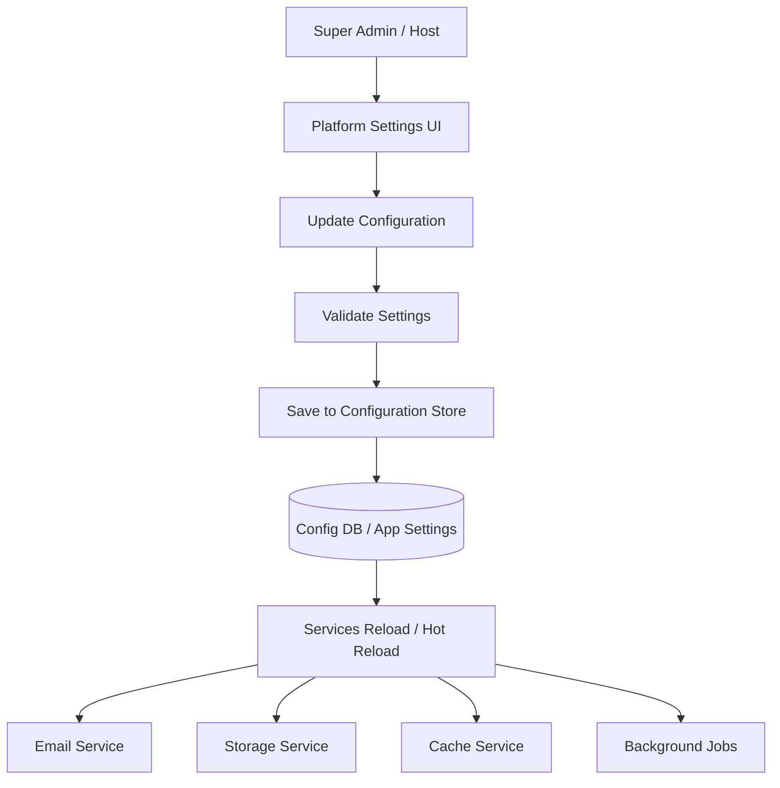

# অধ্যায় ১১: Platform Settings & Global Config

> **Status:** Target design.  
> **As-built:** Host settings UI is **mock** (`host-data.ts`); no persisted platform settings API — [`../AS_BUILT.md`](../AS_BUILT.md).

> **Canonical:** Host global config (SMTP, storage, retention, backup policy)।  
> Backup verify → [২২](./22-monitoring.md) · Security of secrets → [১৮](./18-security-architecture.md)

---

## Platform Settings কী?

**Platform Settings** হলো এমন একটি Module যেখানে Super Admin (Host) পুরো SaaS
Platform-এর Default Configuration নির্ধারণ করবেন।

এই Settings **সব Tenant**-এর উপর প্রভাব ফেলতে পারে — যদি Tenant নিজে Override না করে।

উদাহরণ:

- নতুন Tenant তৈরি হলে Default Trial Period এখান থেকে আসে  
- Invitation email কোন SMTP দিয়ে যাবে এখান থেকে নির্ধারিত  
- Screenshot কোন storage-এ যাবে এখান থেকে নির্ধারিত  
- Maintenance mode চালু হলে সব Tenant-এর login বন্ধ/সীমিত হতে পারে  



---

## ১. General Settings

এখানে Platform-এর সাধারণ তথ্য থাকবে।

### উদাহরণ ফিল্ড

| ফিল্ড | উদাহরণ মান | কেন দরকার |
|-------|-----------|----------|
| Platform Name | Dosi Tracker | Email, login page, invoice header |
| Platform URL | https://app.dositracker.com | Callback links, invite links |
| Support Email | support@dositracker.com | User help |
| Default Timezone | UTC | Report/default scheduling |
| Default Locale | en | নতুন user-এর ভাষা |
| Company Legal Name | Dosi Bridge Ltd. | Invoice/footer |

```
Platform Name:     Dosi Tracker
Platform URL:      https://app.dositracker.com
Support Email:     support@dositracker.com
Default Timezone:  UTC
```

### Validation নিয়ম (সুপারিশ)

- Platform URL অবশ্যই HTTPS  
- Support Email valid format  
- Timezone IANA list থেকে (`Asia/Dhaka`, `UTC`, …)  

---

## ২. Email (SMTP) Configuration

Platform থেকে Email পাঠানোর জন্য SMTP Configuration করা হবে।

### কনফিগ ফিল্ড

| ফিল্ড | উদাহরণ |
|-------|--------|
| SMTP Host | smtp.sendgrid.net / smtp.office365.com |
| SMTP Port | 587 (STARTTLS) বা 465 (SSL) |
| Username | apikey / mailbox user |
| Password | secret (encrypted at rest) |
| From Email | noreply@dositracker.com |
| From Name | Dosi Tracker |
| Enable SSL/TLS | true |
| Test Email button | Super Admin verify করে |

### কোন ইমেইলে ব্যবহার হবে?

1. **Invitation Email** — নতুন member invite  
2. **Password Reset** — forgot password  
3. **Billing Email** — invoice, trial ending, past_due  
4. **Notification Email** — weekly report, low activity alert  
5. **Host alerts** — system errors (optional)  

### নিরাপত্তা নোট

- Password UI-তে আবার দেখানো হয় না (mask)  
- Config store-এ encrypt করে রাখা  
- Secret Git-এ কখনো commit নয়  
- Rate limit: এক user-কে স্প্যাম না করা  

### Test workflow

```
Super Admin → SMTP save → Send Test Email → Inbox check → OK হলে Enable
```

---

## ৩. Storage Configuration

Platform কোথায় Screenshot ও File সংরক্ষণ করবে তা নির্ধারণ করা হবে।

### সম্ভাব্য Storage Provider

| Provider | কখন ব্যবহার |
|----------|-------------|
| Local Storage | Development / single-server |
| Amazon S3 | Production cloud (সবচেয়ে সাধারণ) |
| Azure Blob Storage | Azure-based deploy |
| Google Cloud Storage | GCP-based deploy |

### অতিরিক্ত Configuration

| Setting | উদাহরণ | অর্থ |
|---------|--------|------|
| Maximum Upload Size | 5 MB | এক screenshot/file সীমা |
| File Retention | plan অনুযায়ী বা global max | কতদিন রাখা হবে |
| Backup Location | আলাদা bucket/region | disaster recovery |
| Public Access | false | শুধু presigned URL |
| Path Prefix | `tenants/{tenantId}/shots/` | isolation ও cleanup সহজ |

### কেন DB-তে screenshot রাখা যাবে না?

- Database backup বিশাল হয়ে যায়  
- Query performance খারাপ হয়  
- CDN/object storage সস্তা ও উপযুক্ত  

সঠিক মডেল: **DB = metadata**, **Storage = binary**।

---

## ৪. Cache Configuration

Performance বাড়ানোর জন্য Cache ব্যবহার করা হবে।

### উদাহরণ

```
Cache Provider:  Redis
Connection:      redis://redis:6379
Expiration:      30 Minutes
```

### বিকল্প

| Provider | সুবিধা | সীমাবদ্ধতা |
|----------|--------|-----------|
| In-Memory | সহজ, zero infra | multi-server-এ share হয় না |
| Redis | shared, fast, production | আলাদা service দরকার |

### কী cache করা যায়?

- Dashboard summary (কয়েক সেকেন্ড/মিনিট)  
- Plan catalog  
- Feature flags / global policies  
- Rate limit counters  
- Hot tenant settings  

**সতর্কতা:** Tenant-scoped data cache key-এ অবশ্যই `TenantId` থাকবে —

```
cache:tenant:{tenantId}:dashboard:summary
```

নাহলে এক tenant অন্যের data দেখতে পারে — গুরুতর security bug।

---

## ৫. Background Job Configuration

Background Service-এর Settings।

### উদাহরণ Job তালিকা

| Job | কাজ | Schedule উদাহরণ |
|-----|-----|-----------------|
| Screenshot Processing | blur/resize/move to cold storage | Continuous / every minute |
| Email Queue | SMTP দিয়ে পাঠানো | Continuous |
| Report Generation | weekly/monthly report | Sunday 01:00 |
| Data Cleanup | retention পেরোনো file মুছা | Daily 03:00 |
| Invoice Generation | billing cycle | Daily 00:30 |
| Health Digest | Host-কে system summary | Daily 08:00 |

প্রতিটি Job-এর জন্য নির্ধারণ করা যাবে:

- Enable/Disable  
- Cron schedule  
- Retry count  
- Timeout  
- Concurrency (একসাথে কয়টা)  

Failed job Hangfire/ABP dashboard-এ দেখা যাবে।

---

## ৬. Localization

Platform কোন কোন Language Support করবে তা নির্ধারণ করা হবে।

### ভাষার উদাহরণ

- English  
- বাংলা  
- Hindi  
- Arabic (RTL support সহ)  

### Format Settings

| Setting | উদাহরণ |
|---------|--------|
| Date Format | `yyyy-MM-dd` / `dd/MM/yyyy` |
| Time Format | `HH:mm` / `hh:mm a` |
| Currency Format | `USD`, `BDT`, symbol position |
| First Day of Week | Monday / Sunday |
| Number Format | `1,234.56` vs `1.234,56` |

Tenant চাইলে নিজের locale override করতে পারে; না করলে Platform default লাগে।

---

## ৭. Branding (White-label)

Platform-কে White-label করার জন্য Branding পরিবর্তন করা যাবে।

### উদাহরণ ফিল্ড

| ফিল্ড | উদাহরণ |
|-------|--------|
| Logo | `/branding/logo.svg` |
| Favicon | `/branding/favicon.ico` |
| Primary Color | `#6d5efc` |
| Login Background | image বা gradient |
| Company Name | Partner / Reseller name |
| Email Header Logo | invoice/invite-এ দেখা যায় |

### White-label কেন গুরুত্বপূর্ণ?

Reseller/partner নিজের brand দিয়ে Dosi-Tracker বিক্রি করতে পারে। Host Console থেকে
একবার বদলালে login page, email, PDF report — সব জায়গায় apply হয়।

Enterprise plan-এ per-tenant brandingও আলাদা ফিচার হতে পারে; Platform Settings হলো
**global default**।

---

## ৮. Backup & Restore

Database এবং Storage Backup-এর Configuration।

### উদাহরণ

```
Daily Backup:   02:00 AM
Retention:      30 Days
Targets:        Database + Object Storage inventory
Notify on fail: ops@dositracker.com
```

### Backup কী কভার করবে?

1. PostgreSQL dump / snapshot  
2. Configuration store  
3. Critical object storage (বা lifecycle policy)  
4. (ঐচ্ছিক) Redis RDB — সাধারণত পুনর্গঠনযোগ্য বলে বাধ্যতামূলক নয়  

### Restore

প্রয়োজনে Backup Restore করা যাবে—

- Point-in-time recovery (যদি cloud DB সাপোর্ট করে)  
- Staging-এ আগে restore test  
- Production restore শুধু approved change window-এ  

**নিয়ম:** যে backup কখনো restore test করা হয়নি — সে backup বিশ্বাসযোগ্য নয়।

---

## ৯. Maintenance Settings

Platform Maintenance Mode-এর Configuration।

### উদাহরণ

| ফিল্ড | মান |
|-------|-----|
| Enable Maintenance | true/false |
| Maintenance Message | “We are upgrading. Back at 03:30 UTC.” |
| Start Time | 2026-07-16 02:00 UTC |
| End Time | 2026-07-16 03:30 UTC |
| Allow Host Login | true (Super Admin ঢুকতে পারবে) |
| Block Agent Sync | optional |

Maintenance শেষ হলে Platform স্বাভাবিকভাবে চালু হবে। Agent offline queue-তে রাখবে;
পরে sync করবে — Offline-first-এর সাথে মিলে যায়।

---

## ১০. Global Policies

Host Level থেকে Default Policy নির্ধারণ করা যাবে।

নতুন Tenant তৈরি হলে এই Default Settings প্রয়োগ হবে।

### উদাহরণ Policies

| Policy | উদাহরণ Default | অর্থ |
|--------|----------------|------|
| Default Screenshot Interval | 10 minutes | নতুন project-এর interval |
| Default Idle Timeout | 5 minutes | কতক্ষণ পর idle ধরা হবে |
| Default Trial Period | 14 days | paid plan trial |
| Maximum API Rate Limit | 100 req/min/device | abuse প্রতিরোধ |
| Password Policy | min 8, upper+digit | Identity rules |
| Max Upload Size | 5 MB | storage policy-র সাথে মিল |
| Allow Webcam by Default | false | privacy-first |
| Blur Screenshots by Default | false/true | tenant override করা যায় |
| Data Retention Cap | plan অনুযায়ী max | Host সর্বোচ্চ সীমা |

### Override মডেল

```
Global Policy (Host)
        ↓
Tenant Settings (Owner/Admin) — allowed range-এর মধ্যে
        ↓
Project Permissions — আরও নির্দিষ্ট
```

কঠোর Host policy থাকলে Tenant সেটাকে ঢিলে করতে পারবে না (যেমন retention Host max
ছাড়িয়ে বাড়ানো যাবে না)।

---

## Platform Settings Workflow (বিস্তারিত)

```
Super Admin
    ↓
Host Console → Platform Settings
    ↓
Tab বেছে নাও (General / SMTP / Storage / …)
    ↓
মান পরিবর্তন
    ↓
Validate (client + server)
    ↓
Save
    ↓
Configuration Database / Secure Store
    ↓
Event: SettingsChanged
    ↓
Relevant services reload (SMTP client, storage client, cache options…)
    ↓
Audit log: কে কী বদলেছে
```

### Audit কেন জরুরি?

SMTP host বা storage bucket ভুল বদলালে পুরো platform ভাঙতে পারে। তাই প্রতিটি
পরিবর্তন Audit Log-এ থাকবে:

- Actor (Host user)  
- Before / After (secret mask করে)  
- Timestamp  
- IP (optional)  

---

## UI ট্যাব কাঠামো (প্রস্তাবিত)

```
Platform Settings
├── General
├── Email (SMTP)
├── Storage
├── Cache
├── Background Jobs
├── Localization
├── Branding
├── Backup & Restore
├── Maintenance
└── Global Policies
```

প্রতিটি ট্যাবে:

- Save button  
- Discard changes  
- (প্রয়োজনে) Test connection button  

---

## এই Module-এর সুবিধা

1. **পুরো Platform এক জায়গা থেকে Configure** করা যায়।  
2. **Email, Storage, Cache এবং Background Job** সহজে পরিচালনা করা যায়।  
3. **Branding** পরিবর্তন করে White-label Solution তৈরি করা যায়।  
4. **Backup ও Maintenance** পরিচালনা করা সহজ হয়।  
5. **নতুন Tenant-এর জন্য Default Policy** নির্ধারণ করা যায়।  
6. ভুল config-এর প্রভাব Audit ও Test button দিয়ে কমানো যায়।  

---

## সাধারণ ভুল ও সমাধান

| ভুল | ফল | সমাধান |
|-----|-----|--------|
| SMTP password plain text | leak | encrypt + secret store |
| Cache key-এ TenantId নেই | data leak | সবদা tenant-prefix |
| Local storage multi-server | missing files | shared object storage |
| Backup শুধু DB, storage নয় | screenshot হারায় | দুটোই policy-তে রাখো |
| Maintenance-এ Agent sync জোর করে fail | queue overflow | offline queue + clear message |

---

## এই অধ্যায়ের সারসংক্ষেপ

1. **Platform Settings** হলো পুরো SaaS Platform-এর Global Configuration Center।  
2. **SMTP, Storage, Cache, Localization এবং Branding** এখান থেকে নিয়ন্ত্রণ করা হয়।  
3. **Backup, Restore এবং Maintenance** Configuration করা যায়।  
4. **Global Policy** নির্ধারণ করে সব নতুন Tenant-এর জন্য Default Settings প্রয়োগ করা যায়।  
5. প্রতিটি পরিবর্তন **Validate → Save → Reload → Audit** প্রবাহে যায়।  

🎉 **অধ্যায় ১১ (Platform Settings অংশ) সমাপ্ত।**

→ পরবর্তী বড় বিল্ড অধ্যায়: [অধ্যায় ১৫ — Desktop Agent Development](./15-desktop-agent.md)
