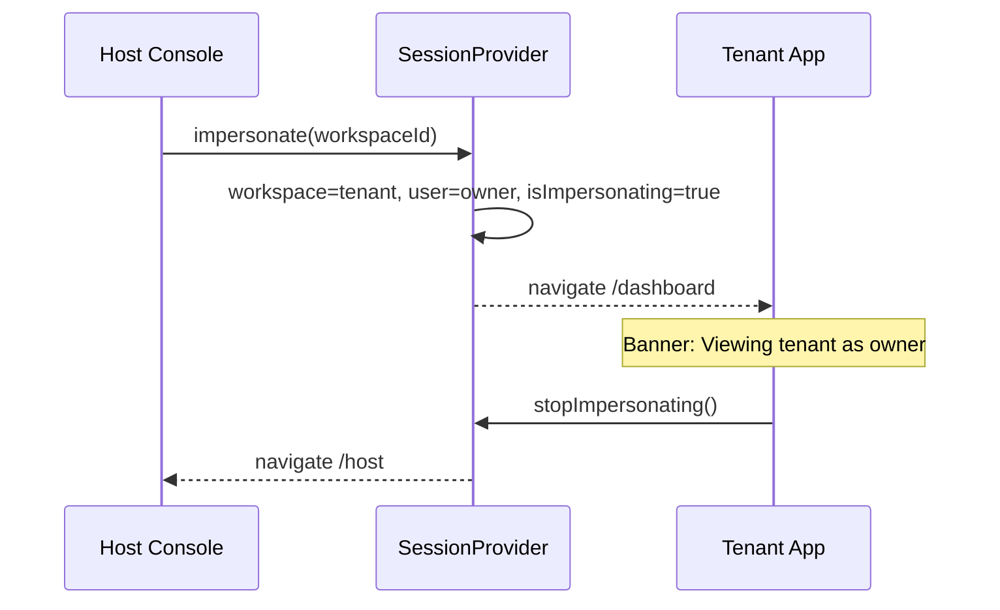

# অধ্যায় ১২: Impersonation Flow

> **Status:** Implemented (demo — `SessionProvider`).  
> **As-built:** `localStorage` only; no audited server impersonation — [`../SECURITY.md`](../SECURITY.md).

> **Canonical:** Host “login as tenant” support workflow।  
> Isolation → [১৩](./13-multi-tenant-isolation.md) · Host UI → DOCUMENTATION §11 · Roles → [০২](./02-personas-roles.md)

---

## উদ্দেশ্য

Host support: **customer যা দেখে** তাই দেখা — billing dispute, onboarding, bug reproduce।  
এটি normal “switch workspace” নয় — Host identity থেকে tenant **owner** view-এ ঢোকে।

---

## Sequence

---

## Entry points

| Place | Action |
|-------|--------|
| `/host/tenants` table | **Login as tenant** |
| Tenant drawer | Same + Manage |
| `/host/users` | Open user's tenant |

`(dashboard)/layout.tsx` — sticky banner + **Return to Host**।

---

## কেন owner user set হয়

একসাথে `workspace` + `user` (tenant owner) set → [১৩](./13-multi-tenant-isolation.md) cross-tenant lookup owner খুঁজে পায়।  
শুধু workspace বদলালে Host user dataset-এ নাও থাকতে পারে।

---

## Demo vs production

| Demo আজ | Production (লক্ষ্য) |
|---------|---------------------|
| Client flag `isImpersonating` | Server-issued short-lived session |
| Anyone with host demo login | `Host.Tenants.Impersonate` permission |
| No expiry | Time-box (e.g. 30–60 min) |
| No reason | Ticket / reason required |
| No audit | Audit log + alert ([২২](./22-monitoring.md)) |

Threat: insider Host abuse — [`../SECURITY.md`](../SECURITY.md)।
