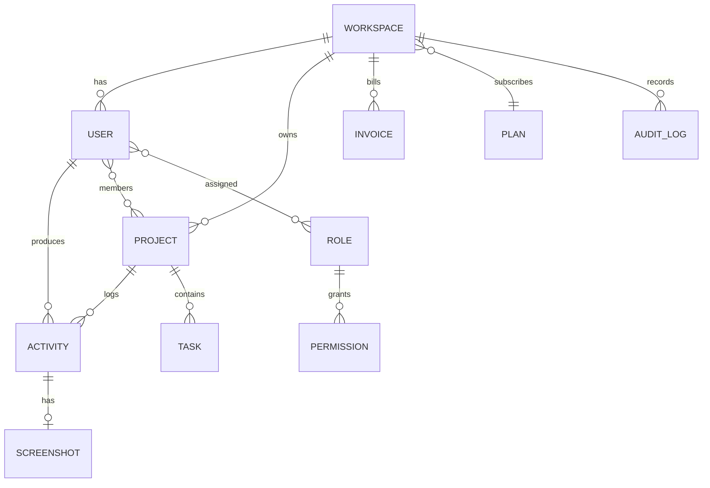

# অধ্যায় ১৬: Database Design & Schema

> **Status:** Target design (product schema).  
> **As-built:** Only ABP/OpenIddict tables after Initial migration — no `activities`/`projects` — [`../AS_BUILT.md`](../AS_BUILT.md).

> **Canonical:** ER, টেবিল, TenantId, index, retention, migrations।  
> কেন multi-tenant ছবি → [০৪](./04-system-architecture.md) ·  
> কেন PostgreSQL → [০৫](./05-technology-stack.md) ·  
> API যে টেবিল ব্যবহার করে → [১৭](./17-api-documentation.md)

---

## লক্ষ্য

High-volume `activities` সহ shared-DB multi-tenant schema যা:

- প্রতি query-তে isolate করে  
- Report দ্রুত চালায়  
- Binary ফুলোয় না  
- EF migration দিয়ে evolve হয়  

---

## ER Diagram



---

## Multi-tenant strategy (এখানেই পূর্ণ)

**Shared database + shared schema + `tenant_id` column** (ABP-native)।

সুবিধা: ops সহজ, খরচ কম, এক migration।  
ঝুঁকি: ভুলে filter বাদ — তাই ABP global query filter + কোড review বাধ্যতামূলক।

Host-side user-এর `tenant_id` null হতে পারে।

অন্যান্য প্যাটার্ন (DB-per-tenant) Enterprise extreme isolation-এ — শুরুতে নয়।

---

## SQL: activities (উদাহরণ)

```sql
CREATE TABLE activities (
  id                 uuid PRIMARY KEY,
  tenant_id          uuid NOT NULL,
  user_id            uuid NOT NULL,
  project_id         uuid NOT NULL,
  client_activity_id uuid NOT NULL,
  started_at         timestamptz NOT NULL,
  ended_at           timestamptz NOT NULL,
  productivity       int NOT NULL CHECK (productivity BETWEEN 0 AND 100),
  mouse_clicks       int NOT NULL DEFAULT 0,
  keyboard_hits      int NOT NULL DEFAULT 0,
  description        varchar(512),
  creation_time      timestamptz NOT NULL DEFAULT now(),
  CONSTRAINT uq_activities_client UNIQUE (tenant_id, client_activity_id),
  CONSTRAINT ck_activities_range CHECK (ended_at > started_at)
);

CREATE INDEX ix_activities_tenant_user_started
  ON activities (tenant_id, user_id, started_at DESC);

CREATE INDEX ix_activities_tenant_project_started
  ON activities (tenant_id, project_id, started_at DESC);
```

`client_activity_id` = Agent offline idempotency ([১৫](./15-desktop-agent.md))।

---

## টেবিল ক্যাটালগ

### workspaces (tenants)
id, name, slug, plan_id, status (`active`|`trialing`|`past_due`), creation_time,
seats_used, storage_used_gb, …

### users
id, tenant_id, email, name, status, timezone, is_active, identity fields (ABP)।  
Presence (`active`/`idle`/`offline`) আলাদা presence store/cache হতে পারে।

### roles / permissions
Owner, Admin, Worker/Member, Client, Host + permission names  
(`Billing.Manage`, `Monitor.ViewAll`, …)। Hardcoded role string এড়ানো।

### projects
title, description, color, interval_minutes, archived,  
permission flags: screenshot, webcam, keyboard, mouse, active_window, running_programs।

### project_members
project_id, user_id, (optional role_in_project)।

### tasks (ঐচ্ছিক)
project_id, title, status, assignee_id, due_date।

### screenshots
id, tenant_id, activity_id, storage_url, blurred, captured_at, size_bytes, content_type।  
Binary object storage-এ — [১১](./11-platform-settings.md)।

### invoices / subscriptions
amount, currency, status, period_start/end, plan snapshot।

### audit_logs
actor_user_id, tenant_id (nullable for host), action, entity_type, entity_id,
extra_properties (masked), creation_time, client_ip।

### report_snapshots (ঐচ্ছিক performance)
tenant_id, slug, range_from, range_to, payload_json, generated_at।

---

## Indexing চেকলিস্ট

| Query | Index |
|-------|-------|
| Member day timeline | (tenant_id, user_id, started_at) |
| Project report | (tenant_id, project_id, started_at) |
| Screenshot gallery | (tenant_id, captured_at DESC) |
| Login email | unique (tenant_id, normalized_email) বা host-global policy অনুযায়ী |
| Invoice list | (tenant_id, date DESC) |

অতিরিক্ত index write ধীর করে — EXPLAIN দিয়ে যোগ করুন।

---

## Performance

1. মাসিক **partition** `activities` / `screenshots` (বড় scale)  
2. Retention job পুরনো row + storage object মুছে ([১১](./11-platform-settings.md) policy)  
3. Report-এর জন্য materialized snapshot বা nightly rollup  
4. Connection pooling  
5. পরে read replica শুধু heavy GET reports  
6. `VACUUM ANALYZE` / autovacuum মনিটর ([২২](./22-monitoring.md))

### Plan retention উদাহরণ

| Plan | Screenshot history |
|------|-------------------|
| Free | 7 days |
| Starter | 30 |
| Business | 180 |
| Enterprise | 365 |

Host global cap Tenant-কে ছাড়াতে দেয় না।

---

## Migrations

- EF Core migrations only  
- Production-এ `DbMigrator` one-shot job ([১৯](./19-devops-cicd.md) / [২১](./21-deployment.md))  
- Expand → deploy → contract sequence (breaking drop আলাদা release)

হাতে prod schema ভাঙবেন না।

---

## সারসংক্ষেপ

Shared DB + `tenant_id` + composite indexes + idempotent activity keys + files outside DB।  
এটি data layer-এর একমাত্র বিস্তারিত অধ্যায়।

→ [অধ্যায় ১৭ — API](./17-api-documentation.md)
