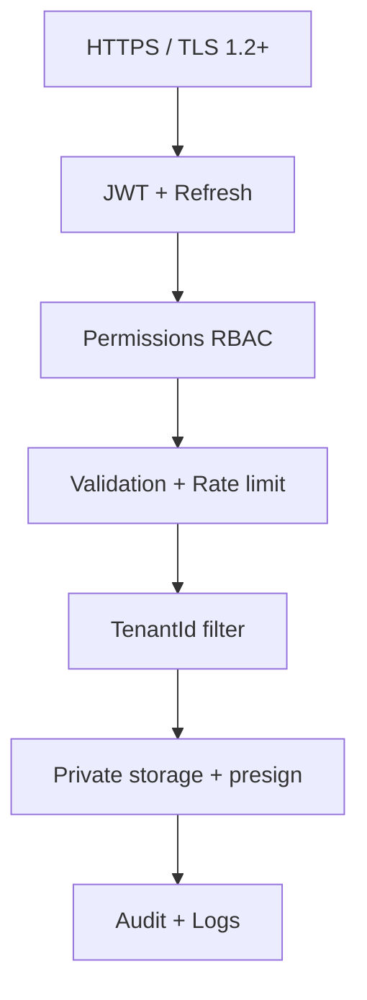

# অধ্যায় ১৮: Security Architecture

> **Status:** Target design (full hardening).  
> **As-built / gaps:** [`../SECURITY.md`](../SECURITY.md) — OpenIddict present; web auth is mock; no product RBAC yet.

> **Canonical:** AuthN/AuthZ, OWASP, encryption, audit, threats।  
> Agent queue encrypt উল্লেখ → [১৫](./15-desktop-agent.md) ·  
> API rate limits list → [১৭](./17-api-documentation.md) ·  
> SMTP password storage → [১১](./11-platform-settings.md)

---

## স্তর মানচিত্র



Client কখনো বিশ্বাসযোগ্য নয় — tenant/role server পুনর্গণনা করে।

---

## JWT

### Access token
- TTL 15–60 মিনিট  
- Claims: `sub`, `tenantid` (বা host), roles/permissions  
- Prefer **RS256** (rotate signing key without shared secret sprawl)

### Refresh token
- Opaque random; DB/Redis-এ **hash** সংরক্ষণ  
- **Rotation:** ব্যবহার = নতুন ইস্যু + পুরনো revoke  
- Reuse detection → পুরো token family revoke (theft signal)

### Agent device tokens
`device_id` claim; user password Agent-এ দীর্ঘস্থায়ী নয় — [১৫](./15-desktop-agent.md)।

---

## HTTPS ও headers

- HSTS  
- TLS 1.2+  
- Secure cookie flags যদি cookie session থাকে  
- CSP, X-Content-Type-Options, Referrer-Policy  

Public HTTP API নয়।

---

## API hardening

| Control | নোট |
|---------|-----|
| Default authenticated | login/forgot ছাড়া anonymous নয় |
| CORS allow-list | শুধু app origin |
| Body size limits | upload ও JSON |
| Rate limits | [১৭](./17-api-documentation.md) টেবিল |
| DTO validation | annotations + domain checks |

---

## RBAC (Roles ও Permissions)

| Role | Scope |
|------|-------|
| host | সব tenant (Host Console) |
| owner | tenant + **billing** |
| admin | tenant ops, **no billing** |
| worker | self activity/monitor |
| client | read-only assigned projects |

Permission উদাহরণ (ABP permission names):

```
Dashboard.View
Projects.Create / Projects.View
Team.Invite / Team.Manage
Monitor.ViewAll / Monitor.ViewSelf
Reports.View
Billing.Manage
Host.Tenants.Manage
Host.Settings.Manage
```

**Anti-pattern:** `if (role == "admin")` ছড়িয়ে।  
**Correct:** `CheckAsync(Permission)`।

Invite UI যেন Admin→Owner escalate না করে (product bug যা security)।

---

## OWASP Top 10 → Dosi mapping

| Risk | Mitigation |
|------|------------|
| Broken Access Control | permissions + tenant filter + tests [২০](./20-testing.md) |
| Cryptographic Failures | TLS, password hash, secret vault, encrypt queue |
| Injection | EF parameterized; no string SQL |
| Insecure Design | offline encrypt; threat model নিচে |
| Misconfiguration | swagger off prod; secure defaults |
| Vulnerable Components | CI audit [১৯](./19-devops-cicd.md) |
| Auth Failures | lockout, refresh rotate, rate limit login |
| Integrity Failures | signed agent updates [১৫](./15-desktop-agent.md) |
| Logging Failures | Serilog + audit; no secrets in logs [২২](./22-monitoring.md) |
| SSRF | validate outbound URLs (webhooks/storage) |

---

## XSS / CSRF / SQLi

**XSS:** React escape; sanitize window titles; CSP; avoid raw HTML।  
**CSRF:** Bearer header প্রাথমিক; cookie auth হলে antiforgery + SameSite।  
**SQLi:** EF LINQ; raw SQL শুধু parameter।

---

## File security (screenshots)

1. AuthZ  
2. Allow-list content-type  
3. Max size (platform setting)  
4. Server re-encode (strip EXIF)  
5. Private bucket random keys  
6. Presigned GET short TTL  
7. Optional malware scan  

User guessable URL পাবে না।

---

## Encryption map

| Data | Approach |
|------|----------|
| Transit | TLS |
| DB disk | cloud volume encryption |
| Secrets | Key Vault / GH Secrets — Git নয় |
| Agent queue | OS keystore / SQLCipher [১৫](./15-desktop-agent.md) |
| Backups | encrypted snapshots [১১](./11-platform-settings.md) |

---

## Audit log (কী লগ করবেন)

বাধ্যতামূলক:
- Login success/fail (careful PII)  
- Impersonation start/stop  
- Plan change, tenant suspend/delete  
- Host settings change (SMTP/storage) — secret **mask**  
- Permission denied (sample high-volume)

Format: actor, action, entity, before/after masked, timestamp, correlationId।

---

## Impersonation

Host → tenant owner view:

- Host.Tenants.Manage only  
- Time-boxed token  
- UI banner বাধ্যতামূলক (frontend)  
- Audit row  
- Optional step-up for billing actions while impersonating  

Product flow: [`DOCUMENTATION.md`](../../DOCUMENTATION.md) Impersonation section।

---

## Threat scenarios

| Scenario | Defense |
|----------|---------|
| Stolen laptop + agent | encrypted queue, short access, remote revoke device |
| Worker calls admin API | 403 permission |
| Token of T1 with body tenant T2 | ignore body; filter T1 |
| Brute force login | lockout + rate limit + captcha |
| Fake screenshot .exe | type allow-list + re-encode |
| Refresh token theft | rotation + reuse detection |

---

## সারসংক্ষেপ

Security এই অধ্যায়ে কেন্দ্রীভূত। অন্য অধ্যায় শুধু প্রয়োগের টুকরো লিঙ্ক করে —
JWT/OWASP এখানে দ্বিতীয়বার লেখা হয় না।

→ [অধ্যায় ১৯ — DevOps](./19-devops-cicd.md)
